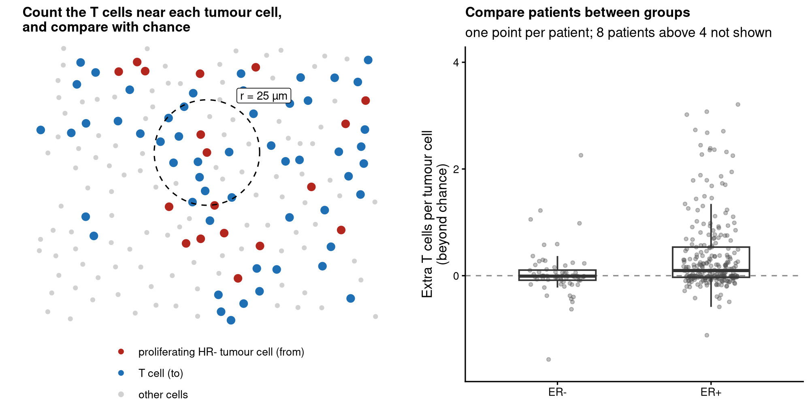

# spicyR 


-lightgrey)

**Test whether cell types co-localise differently between groups of patients.**

Do T cells gather around tumour cells more in one group of patients than in another? spicyR tests this for every
pair of cell types in imaging and spatial transcriptomics data, comparing groups of patients or relating
co-localisation to survival. For each image it asks what fraction of the cells of one type have a cell of another
type within a radius, and compares that with what you would expect if the cells had been labelled at random, using
the cells actually present. Holes, air spaces and uneven cell density therefore do not by themselves create a signal.
Patients, not images or cells, are the units of the test. It needs the type and position of every cell (for
example imaging mass cytometry, CODEX, MIBI, Xenium or CosMx), not spot-based data.



## Quick start

```r
library(spicyR)

spe <- SpatialDatasets::spe_Ali_2020()                          # breast cancer imaging mass cytometry
spe <- spe[, spe$ER.Status %in% c("neg", "pos")]
res <- spicy(spe, condition = "ER.Status", subject = "metabricId", r = 25,   # reference group: "neg"
             imageID = "file_id", cellType = "description")
topPairs(res)                                       # the most significant pairs
signifPlot(res)                                     # every pair at a glance
spicyBoxPlot(res, from = "T cells", to = "HR- Ki67+")   # proliferating tumour cells next to T cells
```

For your own data, `spicy()` accepts a `SpatialExperiment`, a `SingleCellExperiment` or a `data.frame`. It looks
for the columns `imageID` and `cellType` (name yours with `imageID =` and `cellType =`) and takes coordinates from
`spatialCoords()`, or from columns `x` and `y`. A pair `from` → `to` asks whether `to` cells are placed near
`from` cells more than other cells are: the extra fraction of `to` cells with a `from` cell nearby
(`effect = "count"` gives the number of extra `from` cells around each `to` cell instead).

## What you get

- A table with one row per pair of cell types: the extra fraction of `to` cells next to `from` cells in each
  group, the difference, a p-value and an FDR-adjusted p-value. Each `to` cell counts once, however many `from`
  cells are beside it, so more numerous or more tightly packed `from` cells do not inflate the effect.
- A plot of every pair at once, the per-image values behind any pair (interactive, to find the images worth
  looking at), and a plot of any image.
- The same test with covariates, several radii, more than two groups, or a survival outcome.

## Installation

spicyR 2.0, described here, is in the development version of Bioconductor and will be in its next release:

```r
if (!require("BiocManager", quietly = TRUE)) install.packages("BiocManager")
BiocManager::install("spicyR", version = "devel")
BiocManager::install("SydneyBioX/spicyR")     # or the latest version from GitHub
```

`BiocManager::install("spicyR")` with the current Bioconductor release installs spicyR 1.x.

## Coming from spicyR 1.x

spicyR 2.0 changes the default test. The image-level test of earlier versions, which compares a per-image summary of
the L-function with a mixed model, is still available, with the same results, as `spicy(..., method = "image")`.
`topPairs()`, `signifPlot()`, `spicyBoxPlot()` and `bind()` work with both.

## Learn more

- [Introduction to spicyR](https://sydneybiox.github.io/spicyR/dev/articles/spicyR.html): a full analysis of breast
  cancer imaging mass cytometry data.
- [The original image-level test](https://sydneybiox.github.io/spicyR/dev/articles/image_method.html).
- [spicyr](https://sydneybiox.github.io/spicyr-py), the same analysis in Python, for SpatialData and AnnData objects.

## Citation

Canete NP, Iyengar SS, Ormerod JT, Baharlou H, Harman AN, Patrick E (2022). spicyR: spatial analysis of in situ
cytometry data in R. *Bioinformatics* 38(11), 3099–3105.
[doi:10.1093/bioinformatics/btac268](https://doi.org/10.1093/bioinformatics/btac268). A paper describing the
cell-level test is in preparation.

## Contact

Questions and bug reports: [GitHub issues](https://github.com/SydneyBioX/spicyR/issues) or
[ellis.patrick@sydney.edu.au](mailto:ellis.patrick@sydney.edu.au). For developers:
[CONTRIBUTING](CONTRIBUTING.md).

spicyR 2.0 (version 1.99.8) is a development version. Authors: Nicolas Canete, Ellis Patrick, Sadiq Dohadwalla,
Elijah Willie, Nicholas Robertson, Alex Qin, Farhan Ameen and Shreya Rao. Licence: GPL (>= 2).
