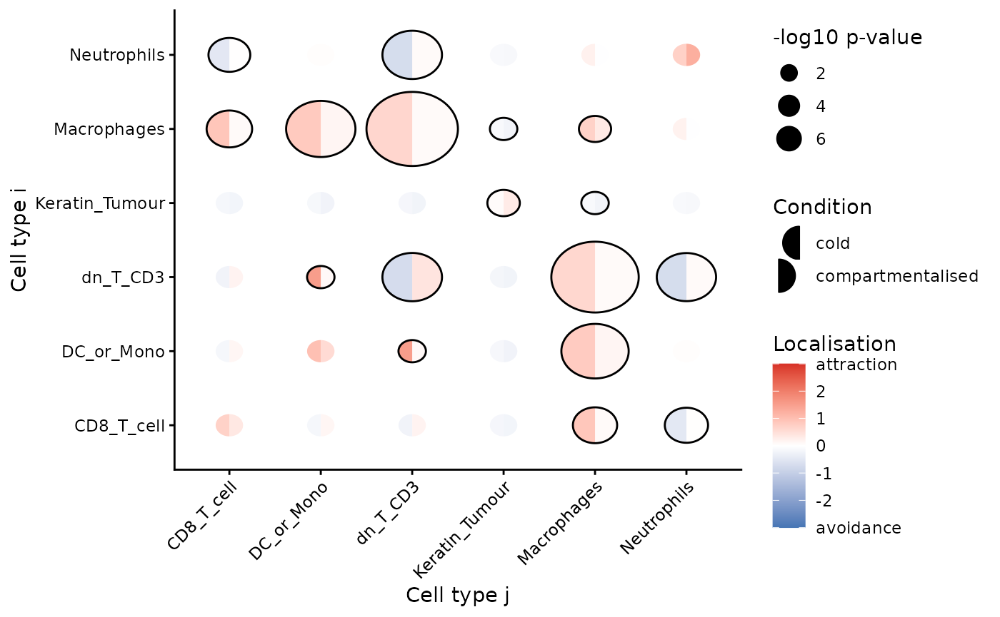
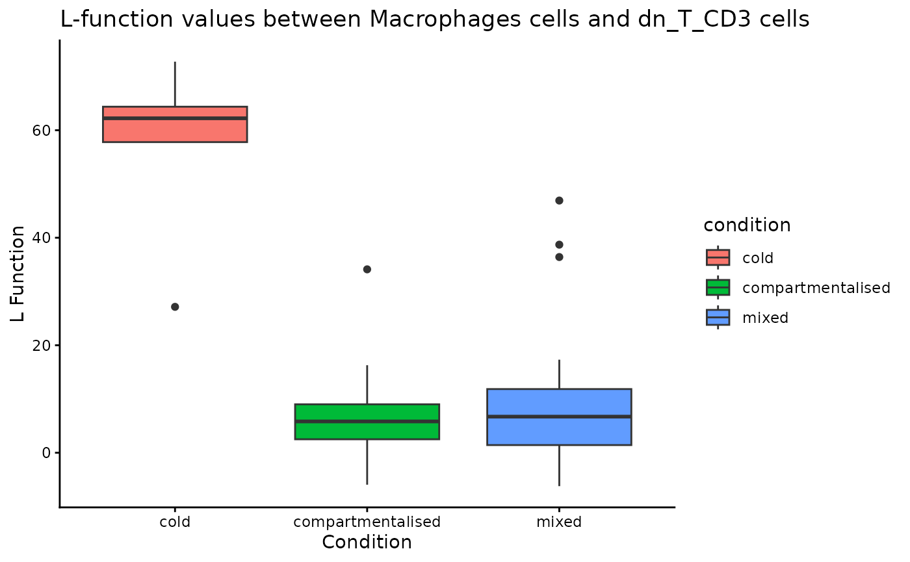
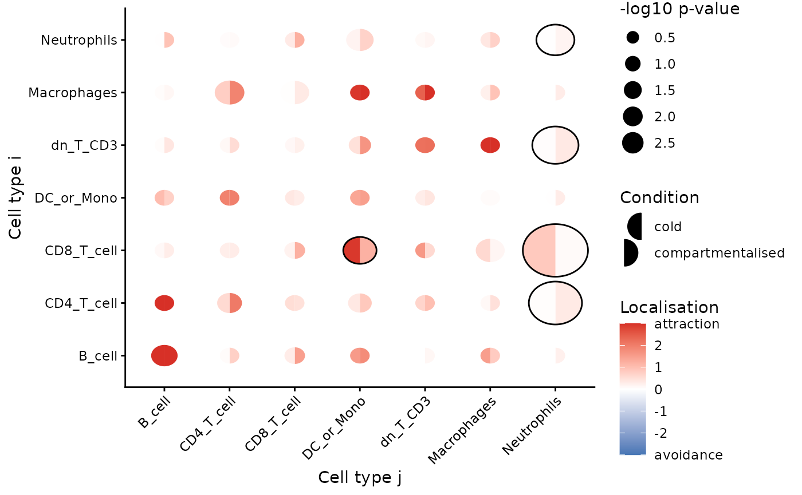
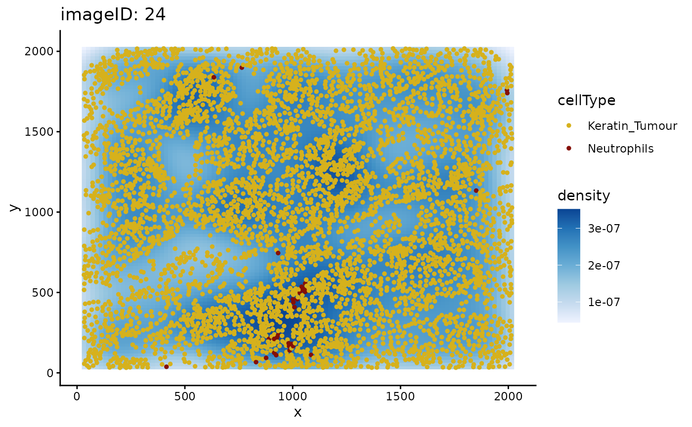

# Spatial Linear and Mixed-Effects Modelling with spicyR

Abstract

Perform linear and mixed-effects models to assess and visualise changes
in cell localisation across disease conditions.

## Installation

``` r
if (!require("BiocManager")) {
  install.packages("BiocManager")
}
BiocManager::install("spicyR")
```

**Note:** There is a bug with the S4 method dispatch system, and
`SingleCellExperiment` and `SpatialExperiment` objects are not correctly
inheriting from `SummarizedExperiment.` One quick fix is to run the code
below:

``` r
# load required packages
library(SummarizedExperiment)

# code to work around the bug
methods::setClassUnion("ExpData", c("matrix", "dgCMatrix", "ExpressionSet",
                                    "SummarizedExperiment"))

library(spicyR)
library(ggplot2)
library(SpatialExperiment)
library(SpatialDatasets)
library(imcRtools)
library(dplyr)
library(survival)
```

## Overview

This guide provides step-by-step instructions on how to apply a linear
model to multiple segmented and labelled images to assess how the
localisation of different cell types changes across different disease
conditions.

## Example data

We use the Keren et al. (2018) breast cancer dataset to compare the
spatial distribution of immune cells in individuals with different
levels of tumour infiltration (cold and compartmentalised).

The data is stored as a `SpatialExperiment` object and contains
single-cell spatial data from 41 images.

**Note:** There is a bug with the S4 method dispatch system, and
`SingleCellExperiment` and `SpatialExperiment` objects are not correctly
inheriting from `SummarizedExperiment.` One quick fix is to run the code
below:

``` r
kerenSPE <- SpatialDatasets::spe_Keren_2018()
```

The cell types in this dataset includes 11 immune cell types (double
negative CD3 T cells, CD4 T cells, B cells, monocytes, macrophages, CD8
T cells, neutrophils, natural killer cells, dendritic cells, regulatory
T cells), 2 structural cell types (endothelial, mesenchymal), 2 tumour
cell types (keratin+ tumour, tumour) and one unidentified category.

## Linear modelling

To investigate changes in localisation between two different cell types,
we measure the level of localisation between two cell types by modelling
with the L-function. The L-function is a variance-stabilised K-function
given by the equation

$$\widehat{L_{ij}}(r) = \sqrt{\frac{\widehat{K_{ij}}(r)}{\pi}}$$

with $\widehat{K_{ij}}$ defined as

$$\widehat{K_{ij}}(r) = \frac{|W|}{n_{i}n_{j}}\sum\limits_{n_{i}}\sum\limits_{n_{j}}1\{ d_{ij} \leq r\} e_{ij}(r)$$

where $\widehat{K_{ij}}$ summarises the degree of co-localisation of
cell type $j$ with cell type $i$, $n_{i}$ and $n_{j}$ are the number of
cells of type $i$ and $j$, $|W|$ is the image area, $d_{ij}$ is the
distance between two cells and $e_{ij}(r)$ is an edge correcting factor.

Specifically, the mean difference between the experimental function and
the theoretical function is used as a measure for the level of
localisation, defined as

$$u = \sum\limits_{r\prime = r_{\text{min}}}^{r_{\text{max}}}{\widehat{L}}_{ij,\text{Experimental}}(r\prime) - {\widehat{L}}_{ij,\text{Poisson}}(r\prime)$$

where $u$ is the sum is taken over a discrete range of $r$ between
$r_{\text{min}}$ and $r_{\text{max}}$. Differences of the statistic $u$
between two conditions is modelled using a weighted linear model.

### Test for change in localisation for a specific pair of cells

Firstly, we can test whether one cell type tends to be more localised
with another cell type in one condition compared to the other. This can
be done using the
[`spicy()`](https://sydneybiox.github.io/spicyR/reference/spicy.md)
function, where we specify the `condition` parameter.

In this example, we want to see whether or not neutrophils (`to`) tend
to be found around CD8 T cells (`from`) in compartmentalised tumours
compared to cold tumours. Given that there are 3 conditions, we can
specify the desired conditions by setting the order of our `condition`
factor. `spicy` will choose the first level of the factor as the base
condition and the second level as the comparison condition. `spicy` will
also naturally coerce the `condition` column into a factor if it is not
already a factor. The column containing cell type annotations can be
specified using the `cellType` argument. By default, `spicy` uses the
column named `cellType` in the `SpatialExperiment` object.

``` r
spicyTestPair <- spicy(
  kerenSPE,
  condition = "tumour_type",
  from = "CD8_T_cell",
  to = "Neutrophils"
)

topPairs(spicyTestPair)
#>                         intercept coefficient      p.value   adj.pvalue
#> CD8_T_cell__Neutrophils  -109.081    112.0185 2.166646e-05 2.166646e-05
#>                               from          to
#> CD8_T_cell__Neutrophils CD8_T_cell Neutrophils
```

We obtain a `spicy` object which details the results of the modelling
performed. The
[`topPairs()`](https://sydneybiox.github.io/spicyR/reference/topPairs.md)
function can be used to obtain the associated coefficients and p-value.

As the `coefficient` in `spicyTestPair` is positive, we find that
neutrophils are significantly more likely to be found near CD8 T cells
in the compartmentalised tumours group compared to the cold tumour
group.

### Test for change in localisation for all pairwise cell combinations

We can perform what we did above for all pairwise combinations of cell
types by excluding the `from` and `to` parameters in
[`spicy()`](https://sydneybiox.github.io/spicyR/reference/spicy.md).

``` r
spicyTest <- spicy(
  kerenSPE,
  condition = "tumour_type"
)

topPairs(spicyTest)
#>                             intercept coefficient      p.value   adj.pvalue
#> Macrophages__dn_T_CD3       56.446064   -50.08474 1.080273e-07 3.035568e-05
#> dn_T_CD3__Macrophages       54.987151   -48.38664 2.194018e-07 3.082595e-05
#> Macrophages__DC_or_Mono     73.239404   -59.90361 5.224660e-06 4.893765e-04
#> DC_or_Mono__Macrophages     71.777087   -58.46833 7.431172e-06 5.220399e-04
#> dn_T_CD3__dn_T_CD3         -63.786032   100.61010 2.878804e-05 1.208706e-03
#> Neutrophils__dn_T_CD3      -63.141840    69.64356 2.891872e-05 1.208706e-03
#> dn_T_CD3__Neutrophils      -63.133725    70.15508 3.011012e-05 1.208706e-03
#> DC__Macrophages             96.893239   -92.55112 1.801300e-04 5.758129e-03
#> Macrophages__DC             96.896215   -93.25194 1.844241e-04 5.758129e-03
#> CD4_T_cell__Keratin_Tumour  -4.845037   -22.14995 2.834659e-04 7.409016e-03
#>                                   from             to
#> Macrophages__dn_T_CD3      Macrophages       dn_T_CD3
#> dn_T_CD3__Macrophages         dn_T_CD3    Macrophages
#> Macrophages__DC_or_Mono    Macrophages     DC_or_Mono
#> DC_or_Mono__Macrophages     DC_or_Mono    Macrophages
#> dn_T_CD3__dn_T_CD3            dn_T_CD3       dn_T_CD3
#> Neutrophils__dn_T_CD3      Neutrophils       dn_T_CD3
#> dn_T_CD3__Neutrophils         dn_T_CD3    Neutrophils
#> DC__Macrophages                     DC    Macrophages
#> Macrophages__DC            Macrophages             DC
#> CD4_T_cell__Keratin_Tumour  CD4_T_cell Keratin_Tumour
```

Again, we obtain a `spicy` object which outlines the result of the
linear models performed for each pairwise combination of cell types.

We can also examine the L-function metrics of individual images by using
the convenient
[`bind()`](https://sydneybiox.github.io/spicyR/reference/bind.md)
function on our `spicyTest` results object.

``` r
bind(spicyTest)[1:5, 1:5]
#>   imageID         condition Keratin_Tumour__Keratin_Tumour
#> 1       1             mixed                      -2.300602
#> 2       2             mixed                      -1.989699
#> 3       3 compartmentalised                      11.373530
#> 4       4 compartmentalised                      33.931133
#> 5       5 compartmentalised                      17.922818
#>   dn_T_CD3__Keratin_Tumour B_cell__Keratin_Tumour
#> 1                -5.298543             -20.827279
#> 2               -16.020022               3.025815
#> 3               -21.857447             -24.962913
#> 4               -36.438476             -40.470221
#> 5               -20.816783             -38.138076
```

The results can be represented as a bubble plot using the
[`signifPlot()`](https://sydneybiox.github.io/spicyR/reference/signifPlot.md)
function.

``` r
signifPlot(
  spicyTest,
  breaks = c(-3, 3, 1),
  marksToPlot = c("Macrophages", "DC_or_Mono", "dn_T_CD3", "Neutrophils",
                  "CD8_T_cell", "Keratin_Tumour")
)
```



Here, we can observe that the most significant relationships occur
between macrophages and double negative CD3 T cells, suggesting that the
two cell types are far more dispersed in compartmentalised tumours
compared to cold tumours.

To examine a specific cell type-cell type relationship in more detail,
we can use `spicyBoxplot()` and specify either `from = "Macrophages"`
and `to = "dn_T_CD3"` or `rank = 1`.

``` r
spicyBoxPlot(results = spicyTest, 
             # from = "Macrophages",
             # to = "dn_T_CD3"
             rank = 1)
```



## Linear modelling for custom metrics

`spicyR` can also be applied to custom distance or abundance metrics. A
kNN interactions graph can be generated with the function
`buildSpatialGraph` from the `imcRtools` package. This generates a
`colPairs` object inside of the `SpatialExperiment` object.

`spicyR` provides the function `convPairs` for converting a `colPairs`
object into an abundance matrix by calculating the average number of
nearby cells types for every cell type for a given `k`. For example, if
there exists on average 5 neutrophils for every macrophage in image 1,
the column `Neutrophil__Macrophage` would have a value of 5 for image 1.

``` r
kerenSPE <- imcRtools::buildSpatialGraph(kerenSPE, 
                                         img_id = "imageID", 
                                         type = "knn", k = 20,
                                        coords = c("x", "y"))

pairAbundances <- convPairs(kerenSPE,
                  colPair = "knn_interaction_graph")

head(pairAbundances["B_cell__B_cell"])
#>    B_cell__B_cell
#> 1      12.7349608
#> 10      0.2777778
#> 11      0.0000000
#> 12      1.3333333
#> 13      1.2200957
#> 14      0.0000000
```

The custom distance or abundance metrics can then be included in the
analysis with the `alternateResult` parameter. The `Statial` package
contains other custom distance metrics which can be used with `spicy`.

``` r
spicyTestColPairs <- spicy(
  kerenSPE,
  condition = "tumour_type",
  alternateResult = pairAbundances,
  weights = FALSE
)

topPairs(spicyTestColPairs)
#>                            intercept coefficient     p.value adj.pvalue
#> CD8_T_cell__Neutrophils  0.833333333  -0.7592968 0.002645466  0.3291833
#> B_cell__Tumour           0.001937984   0.2602822 0.004872664  0.3291833
#> Other_Immune__NK         0.012698413   0.2612881 0.005673068  0.3291833
#> Unidentified__CD8_T_cell 0.106626794   0.6387339 0.005906526  0.3291833
#> dn_T_CD3__NK             0.004242424   0.2148797 0.006317829  0.3291833
#> CD4_T_cell__Neutrophils  0.036213602   0.2947696 0.007902670  0.3291833
#> Tregs__CD4_T_cell        0.128876212   0.5726201 0.010207087  0.3291833
#> Endothelial__DC          0.008771930   0.3008523 0.011189533  0.3291833
#> Tumour__Neutrophils      0.021638939   0.2529045 0.011388850  0.3291833
#> Mesenchymal__Neutrophils 0.004504505   0.2494301 0.012761315  0.3291833
#>                                  from          to
#> CD8_T_cell__Neutrophils    CD8_T_cell Neutrophils
#> B_cell__Tumour                 B_cell      Tumour
#> Other_Immune__NK         Other_Immune          NK
#> Unidentified__CD8_T_cell Unidentified  CD8_T_cell
#> dn_T_CD3__NK                 dn_T_CD3          NK
#> CD4_T_cell__Neutrophils    CD4_T_cell Neutrophils
#> Tregs__CD4_T_cell               Tregs  CD4_T_cell
#> Endothelial__DC           Endothelial          DC
#> Tumour__Neutrophils            Tumour Neutrophils
#> Mesenchymal__Neutrophils  Mesenchymal Neutrophils
```

``` r
signifPlot(
  spicyTestColPairs,
  breaks = c(-3, 3, 1),
  marksToPlot = c("Macrophages", "dn_T_CD3", "CD4_T_cell", 
                  "B_cell", "DC_or_Mono", "Neutrophils", "CD8_T_cell")
)
```



## Performing survival analysis

`spicy` can also be used to perform survival analysis to asses whether
changes in co-localisation between cell types are associated with
survival probability. `spicy` requires the `SingleCellExperiment` object
being used to contain a column called `survival` as a `Surv` object.

``` r
kerenSPE$event = 1 - kerenSPE$Censored
kerenSPE$survival = Surv(kerenSPE$`Survival_days_capped*`, kerenSPE$event)
```

We can then perform survival analysis using the `spicy` function by
specifying `condition = "survival"`. We can then access the
corresponding coefficients and p-values by accessing the
`survivalResults` slot in the `spicy` results object.

``` r
# Running survival analysis
spicySurvival = spicy(kerenSPE,
                      condition = "survival")

# top 10 significant pairs
head(spicySurvival$survivalResults, 10)
#> # A tibble: 10 × 4
#>    test                       coef se.coef    p.value
#>    <chr>                     <dbl>   <dbl>      <dbl>
#>  1 Other_Immune__Tregs     0.0236  0.00866 0.00000893
#>  2 CD4_T_cell__Tregs       0.0177  0.00685 0.0000124 
#>  3 Tregs__Other_Immune     0.0237  0.00873 0.0000126 
#>  4 Tregs__CD4_T_cell       0.0171  0.00676 0.0000285 
#>  5 CD8_T_cell__CD8_T_cell  0.00605 0.00272 0.000332  
#>  6 Tumour__CD8_T_cell     -0.0305  0.0114  0.000617  
#>  7 CD8_T_cell__Tumour     -0.0305  0.0116  0.000721  
#>  8 CD4_T_cell__dn_T_CD3    0.00845 0.00353 0.000794  
#>  9 dn_T_CD3__CD4_T_cell    0.00840 0.00353 0.000937  
#> 10 DC__Other_Immune       -0.0289  0.0123  0.00103
```

## Accounting for tissue inhomogeneity

The `spicy` function can also account for tissue inhomogeneity to avoid
false positives or negatives. This can be done by setting the `sigma =`
parameter within the spicy function. By default, `sigma` is set to
`NULL`, and `spicy` assumes a homogeneous tissue structure.

For example, when we examine the L-function for
`Keratin_Tumour__Neutrophils` when `sigma = NULL` and `Rs = 100`, the
value is positive, indicating attraction between the two cell types.

``` r
# filter SPE object to obtain image 24 data
kerenSubset = kerenSPE[, colData(kerenSPE)$imageID == "24"]

pairwiseAssoc = getPairwise(kerenSubset, 
                            sigma = NULL, 
                            Rs = 100) |>
  as.data.frame()

pairwiseAssoc[["Keratin_Tumour__Neutrophils"]]
#> [1] 10.88892
```

When we specify `sigma = 20` and re-calculate the L-function, it
indicates that there is no relationship between `Keratin_Tumour` and
`Neutrophils`, i.e., there is no major attraction or dispersion, as it
now takes into account tissue inhomogeneity.

``` r
pairwiseAssoc = getPairwise(kerenSubset, 
                            sigma = 20, 
                            Rs = 100) |>
  as.data.frame()

pairwiseAssoc[["Keratin_Tumour__Neutrophils"]]
#> [1] 0.9024836
```

We can use the `plotImage` function to plot any pair of cell types for a
specific image and visually inspect cellular relationships.

``` r
plotImage(kerenSPE, "24", from = "Keratin_Tumour", to = "Neutrophils")
```



Plotting image 24 shows that the supposed co-localisation occurs due to
the dense cluster of cells near the bottom of the image.

## Mixed effects modelling

`spicyR` supports mixed effects modelling when multiple images are
obtained for each subject. In this case, `subject` is treated as a
random effect and `condition` is treated as a fixed effect. To perform
mixed effects modelling, we can specify the `subject` parameter in the
`spicy` function.

``` r
spicyMixedTest <- spicy(
  diabetesData,
  condition = "stage",
  subject = "case"
)
```

## References

``` r
sessionInfo()
#> R version 4.5.2 (2025-10-31)
#> Platform: x86_64-pc-linux-gnu
#> Running under: Ubuntu 24.04.3 LTS
#> 
#> Matrix products: default
#> BLAS:   /usr/lib/x86_64-linux-gnu/openblas-pthread/libblas.so.3 
#> LAPACK: /usr/lib/x86_64-linux-gnu/openblas-pthread/libopenblasp-r0.3.26.so;  LAPACK version 3.12.0
#> 
#> locale:
#>  [1] LC_CTYPE=C.UTF-8       LC_NUMERIC=C           LC_TIME=C.UTF-8       
#>  [4] LC_COLLATE=C.UTF-8     LC_MONETARY=C.UTF-8    LC_MESSAGES=C.UTF-8   
#>  [7] LC_PAPER=C.UTF-8       LC_NAME=C              LC_ADDRESS=C          
#> [10] LC_TELEPHONE=C         LC_MEASUREMENT=C.UTF-8 LC_IDENTIFICATION=C   
#> 
#> time zone: UTC
#> tzcode source: system (glibc)
#> 
#> attached base packages:
#> [1] stats4    stats     graphics  grDevices utils     datasets  methods  
#> [8] base     
#> 
#> other attached packages:
#>  [1] survival_3.8-3              dplyr_1.2.0                
#>  [3] imcRtools_1.16.0            SpatialDatasets_1.8.0      
#>  [5] ExperimentHub_3.0.0         AnnotationHub_4.0.0        
#>  [7] BiocFileCache_3.0.0         dbplyr_2.5.2               
#>  [9] SpatialExperiment_1.20.0    SingleCellExperiment_1.32.0
#> [11] ggplot2_4.0.2               spicyR_1.21.8              
#> [13] SummarizedExperiment_1.40.0 Biobase_2.70.0             
#> [15] GenomicRanges_1.62.1        Seqinfo_1.0.0              
#> [17] IRanges_2.44.0              S4Vectors_0.48.0           
#> [19] BiocGenerics_0.56.0         generics_0.1.4             
#> [21] MatrixGenerics_1.22.0       matrixStats_1.5.0          
#> [23] BiocStyle_2.38.0           
#> 
#> loaded via a namespace (and not attached):
#>   [1] fs_1.6.6                    spatstat.sparse_3.1-0      
#>   [3] bitops_1.0-9                sf_1.1-0                   
#>   [5] EBImage_4.52.0              httr_1.4.8                 
#>   [7] RColorBrewer_1.1-3          numDeriv_2016.8-1.1        
#>   [9] tools_4.5.2                 doRNG_1.8.6.3              
#>  [11] backports_1.5.0             utf8_1.2.6                 
#>  [13] R6_2.6.1                    DT_0.34.0                  
#>  [15] HDF5Array_1.38.0            mgcv_1.9-3                 
#>  [17] rhdf5filters_1.22.0         sp_2.2-1                   
#>  [19] withr_3.0.2                 gridExtra_2.3              
#>  [21] coxme_2.2-22                ClassifyR_3.14.0           
#>  [23] cli_3.6.5                   textshaping_1.0.4          
#>  [25] spatstat.explore_3.7-0      labeling_0.4.3             
#>  [27] sass_0.4.10                 nnls_1.6                   
#>  [29] S7_0.2.1                    spatstat.data_3.1-9        
#>  [31] readr_2.2.0                 proxy_0.4-29               
#>  [33] pkgdown_2.2.0               systemfonts_1.3.1          
#>  [35] ggupset_0.4.1               svglite_2.2.2              
#>  [37] simpleSeg_1.12.0            RSQLite_2.4.6              
#>  [39] vroom_1.7.0                 spatstat.random_3.4-4      
#>  [41] car_3.1-5                   scam_1.2-21                
#>  [43] Matrix_1.7-4                ggbeeswarm_0.7.3           
#>  [45] abind_1.4-8                 terra_1.8-93               
#>  [47] lifecycle_1.0.5             yaml_2.3.12                
#>  [49] carData_3.0-6               rhdf5_2.54.1               
#>  [51] SparseArray_1.10.8          grid_4.5.2                 
#>  [53] blob_1.3.0                  promises_1.5.0             
#>  [55] crayon_1.5.3                bdsmatrix_1.3-7            
#>  [57] shinydashboard_0.7.3        lattice_0.22-7             
#>  [59] beachmat_2.26.0             KEGGREST_1.50.0            
#>  [61] magick_2.9.0                cytomapper_1.22.0          
#>  [63] pillar_1.11.1               knitr_1.51                 
#>  [65] dcanr_1.26.0                RTriangle_1.6-0.15         
#>  [67] rjson_0.2.23                boot_1.3-32                
#>  [69] codetools_0.2-20            glue_1.8.0                 
#>  [71] spatstat.univar_3.1-6       data.table_1.18.2.1        
#>  [73] MultiAssayExperiment_1.36.1 vctrs_0.7.1                
#>  [75] png_0.1-8                   Rdpack_2.6.6               
#>  [77] gtable_0.3.6                cachem_1.1.0               
#>  [79] xfun_0.56                   rbibutils_2.4.1            
#>  [81] S4Arrays_1.10.1             mime_0.13                  
#>  [83] tidygraph_1.3.1             reformulas_0.4.4           
#>  [85] pheatmap_1.0.13             iterators_1.0.14           
#>  [87] units_1.0-0                 nlme_3.1-168               
#>  [89] bit64_4.6.0-1               filelock_1.0.3             
#>  [91] bslib_0.10.0                svgPanZoom_0.3.4           
#>  [93] KernSmooth_2.23-26          vipor_0.4.7                
#>  [95] otel_0.2.0                  DBI_1.2.3                  
#>  [97] raster_3.6-32               tidyselect_1.2.1           
#>  [99] bit_4.6.0                   compiler_4.5.2             
#> [101] curl_7.0.0                  httr2_1.2.2                
#> [103] BiocNeighbors_2.4.0         h5mread_1.2.1              
#> [105] desc_1.4.3                  DelayedArray_0.36.0        
#> [107] bookdown_0.46               scales_1.4.0               
#> [109] classInt_0.4-11             distances_0.1.13           
#> [111] rappdirs_0.3.4              tiff_0.1-12                
#> [113] stringr_1.6.0               digest_0.6.39              
#> [115] goftest_1.2-3               fftwtools_0.9-11           
#> [117] spatstat.utils_3.2-1        minqa_1.2.8                
#> [119] rmarkdown_2.30              XVector_0.50.0             
#> [121] htmltools_0.5.9             pkgconfig_2.0.3            
#> [123] jpeg_0.1-11                 lme4_1.1-38                
#> [125] fastmap_1.2.0               rlang_1.1.7                
#> [127] htmlwidgets_1.6.4           ggthemes_5.2.0             
#> [129] shiny_1.13.0                ggh4x_0.3.1                
#> [131] farver_2.1.2                jquerylib_0.1.4            
#> [133] jsonlite_2.0.0              BiocParallel_1.44.0        
#> [135] RCurl_1.98-1.17             magrittr_2.0.4             
#> [137] scuttle_1.20.0              Formula_1.2-5              
#> [139] Rhdf5lib_1.32.0             Rcpp_1.1.1                 
#> [141] ggnewscale_0.5.2            viridis_0.6.5              
#> [143] stringi_1.8.7               ggraph_2.2.2               
#> [145] MASS_7.3-65                 plyr_1.8.9                 
#> [147] parallel_4.5.2              ggrepel_0.9.6              
#> [149] deldir_2.0-4                Biostrings_2.78.0          
#> [151] graphlayouts_1.2.3          splines_4.5.2              
#> [153] tensor_1.5.1                hms_1.1.4                  
#> [155] locfit_1.5-9.12             igraph_2.2.2               
#> [157] ggpubr_0.6.2                spatstat.geom_3.7-0        
#> [159] ggsignif_0.6.4              rngtools_1.5.2             
#> [161] reshape2_1.4.5              BiocVersion_3.22.0         
#> [163] evaluate_1.0.5              BiocManager_1.30.27        
#> [165] tzdb_0.5.0                  nloptr_2.2.1               
#> [167] foreach_1.5.2               tweenr_2.0.3               
#> [169] httpuv_1.6.16               tidyr_1.3.2                
#> [171] purrr_1.2.1                 polyclip_1.10-7            
#> [173] BiocBaseUtils_1.12.0        ggforce_0.5.0              
#> [175] broom_1.0.12                xtable_1.8-8               
#> [177] e1071_1.7-17                rstatix_0.7.3              
#> [179] later_1.4.7                 class_7.3-23               
#> [181] viridisLite_0.4.3           ragg_1.5.0                 
#> [183] tibble_3.3.1                lmerTest_3.2-0             
#> [185] memoise_2.0.1               beeswarm_0.4.0             
#> [187] AnnotationDbi_1.72.0        concaveman_1.2.0
```

Keren, L, M Bosse, D Marquez, R Angoshtari, S Jain, S Varma, S Yang, et
al. 2018. “A Structured Tumor-Immune Microenvironment in Triple Negative
Breast Cancer Revealed by Multiplexed Ion Beam Imaging.” *Cell* 174 (6):
1373–1387.e19.
