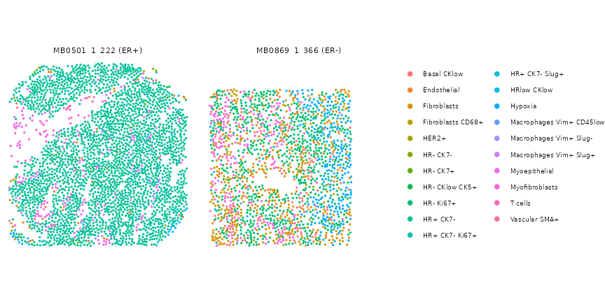
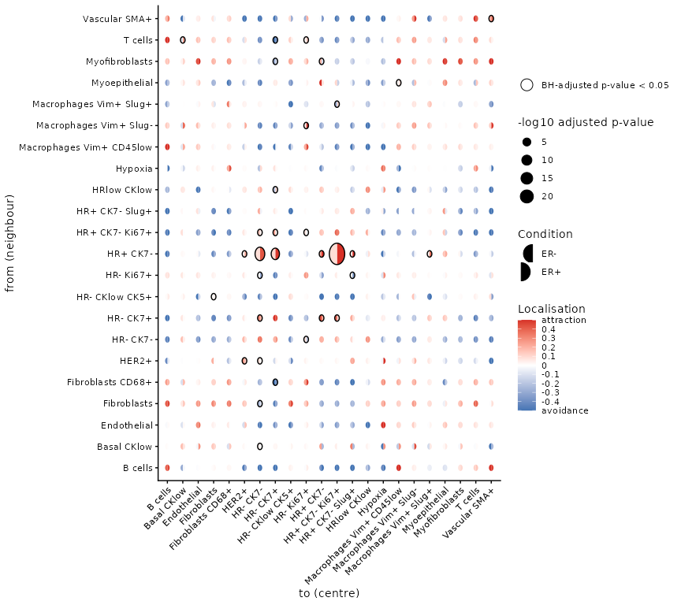
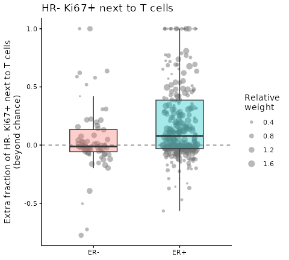
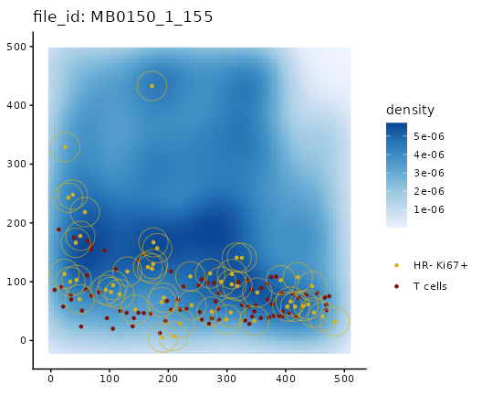
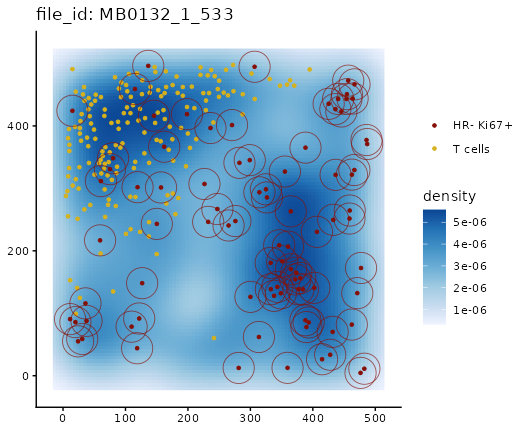
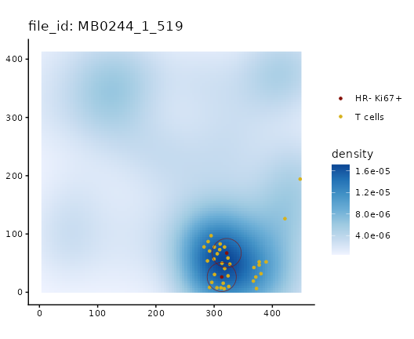
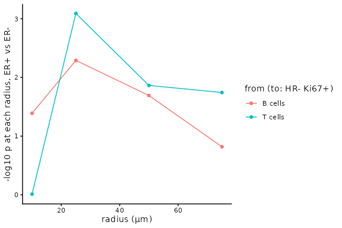
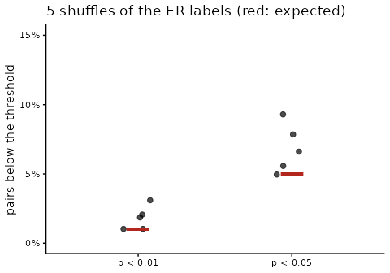

# Introduction to spicyR

Abstract

Do T cells gather around tumour cells more in ER-positive breast cancers
than in ER-negative ones? Do patients whose tumour cells are surrounded
by immune cells relapse later? spicyR answers questions like these for
every pair of cell types in an imaging study. This vignette works
through a study of 456 breast tumours: testing every pair, looking
closely at one, finding the images behind the result, and checking that
the test behaves when there is nothing to find.

## Introduction

A pair is written `from` → `to` and asks whether `to` cells are placed
near `from` cells more than other cells are. For each `to` cell, spicyR
checks whether there is a `from` cell within a radius, and compares the
share of `to` cells that have one with what we would expect if the `to`
cells were a random choice among the cells of the same image that are
not `from` cells. The effect is the **fraction of `to` cells placed next
to `from` cells**, beyond chance: 0.2 means as if a fifth of the `to`
cells had been moved next to `from` cells and the rest left where chance
would put them. For a pair whose `to` cells avoid the `from` cells
(fewer have one nearby than chance, over all images), the effect is
measured the other way: -0.2 means as if a fifth of the `to` cells that
chance would put next to a `from` cell had been moved away. The `side`
column says which scale a pair uses. Each `to` cell counts once, however
many `from` cells are beside it, so more numerous or more tightly packed
`from` cells do not inflate the effect. Because the comparison uses only
the cells that are actually there, empty regions such as holes or air
spaces, and uneven cell density, do not by themselves create a signal
(artefacts that affect one cell type more than others are not removed).
spicyR then compares the effect between groups of patients, treating
patients, not images or cells, as the units of the test.

**Pairs are directional.** Tumour cells → T cells asks whether T cells
are placed near tumour cells (the extra fraction of T cells with a
tumour cell nearby), which is a different question from T cells → tumour
cells (are tumour cells placed near T cells?).

spicyR needs the type and position of every cell, as from imaging mass
cytometry, CODEX, MIBI, Xenium, CosMx or MERSCOPE; it is not designed
for spot-based data such as Visium.

Other Bioconductor packages also study how cell types are arranged.
*imcRtools* tests interactions between cell types within each image by
permutation, *spatialFDA* compares spatial summary functions between
samples with functional models, and *panoramic* compares a
co-localisation statistic across samples. spicyR is built for the
comparison between groups of patients: it measures co-localisation
against random labelling of the cells actually present, on a scale that
more numerous or more tightly packed cells do not inflate, treats
patients as the units, and uses a test designed to keep false positives
at the nominal rate with modest numbers of patients. It also relates
co-localisation to survival. It works alongside other SydneyBioX
packages: per-image statistics from *Statial* can be compared between
groups with spicyR’s image-level test, and *lisaClust* finds spatial
regions.


The pair T cells → proliferating tumour cells. For each proliferating
tumour cell (red, the `to` type), spicyR checks whether a T cell (blue,
the `from` type) lies within 25 µm, and compares the share of tumour
cells that have one with chance. Each patient gets an effect, and the
effect is compared between ER-negative and ER-positive tumours.

## Installation

spicyR 2.0, described here, is in the development version of
Bioconductor and will be in its next release. Install it with
BiocManager, using Bioconductor devel, or from GitHub:

``` r

if (!requireNamespace("BiocManager", quietly = TRUE)) install.packages("BiocManager")
BiocManager::install("spicyR", version = "devel")

# or, from GitHub
BiocManager::install("SydneyBioX/spicyR")
```

``` r

library(spicyR)
library(SpatialDatasets)
library(ggplot2)
library(survival)
```

## The data

We use imaging mass cytometry of breast tumours from the METABRIC cohort
(Ali et al. 2020). Each of the 456 patients with known oestrogen
receptor (ER) status contributed one tumour core, and the authors
assigned each cell to one of 22 types. Their labels name tumour cells by
marker: HR is hormone receptor, CK cytokeratin, and Ki67+ marks
proliferating cells, so `HR- Ki67+` are proliferating
hormone-receptor-negative tumour cells. The data are a
`SpatialExperiment` in the SpatialDatasets package, with coordinates in
micrometres.

``` r

spe <- spe_Ali_2020()
spe <- spe[, spe$ER.Status %in% c("neg", "pos")]
spe$ER <- factor(ifelse(spe$ER.Status == "pos", "ER+", "ER-"), levels = c("ER-", "ER+"))

table(unique(as.data.frame(SummarizedExperiment::colData(spe))[, c("metabricId", "ER")])$ER)
#> 
#> ER- ER+ 
#>  83 373
sort(table(spe$description), decreasing = TRUE)
#> 
#>                 HR+ CK7-           Myofibroblasts              Fibroblasts 
#>                   114828                    57295                    49043 
#>                 HR- CK7-                 HR- CK7+              HRlow CKlow 
#>                    34951                    29432                    22824 
#>                  T cells           HR+ CK7- Ki67+        Fibroblasts CD68+ 
#>                    19218                    17203                    13716 
#>                HR- Ki67+           HR+ CK7- Slug+   Macrophages Vim+ Slug- 
#>                    13062                     7417                     6721 
#>                  Hypoxia            Myoepithelial                    HER2+ 
#>                     5639                     4637                     4434 
#>   Macrophages Vim+ Slug+ Macrophages Vim+ CD45low              Endothelial 
#>                     3657                     3600                     3480 
#>                  B cells              Basal CKlow            Vascular SMA+ 
#>                     3232                     3226                     2908 
#>           HR- CKlow CK5+ 
#>                     2106
```

``` r

cells <- data.frame(SummarizedExperiment::colData(spe), SpatialExperiment::spatialCoords(spe))
size <- table(cells$file_id)                                  # show the largest core of each group
twoCores <- sapply(c("ER-", "ER+"), function(g) { k <- unique(cells$file_id[cells$ER == g]); k[which.max(size[k])] })
oneEach <- cells[cells$file_id %in% twoCores, ]
oneEach$core <- paste0(oneEach$file_id, " (", oneEach$ER, ")")
ggplot(oneEach, aes(Location_Center_X, Location_Center_Y, colour = description)) +
  geom_point(size = 0.5) +
  facet_wrap(~ core) +
  coord_equal() +
  labs(colour = NULL) +
  theme_void() +
  theme(legend.text = element_text(size = 7)) +
  guides(colour = guide_legend(override.aes = list(size = 2)))
```



## Testing every pair of cell types

[`spicy()`](https://sydneybiox.github.io/spicyR/dev/reference/spicy.md)
needs the column of the condition, the column of the patient (`subject`)
and a radius. It accepts a `SpatialExperiment`, a `SingleCellExperiment`
or a `data.frame` with one row per cell. By default it looks for columns
called `imageID` and `cellType`; here we name the dataset’s own columns.
The coordinates of a `SpatialExperiment` are taken from
[`spatialCoords()`](https://rdrr.io/pkg/SpatialExperiment/man/SpatialExperiment-methods.html).

**Choosing the radius.** Choose it before looking at the results, from
the scale at which you expect cells to interact: 10 to 25 µm for
contact, 50 to 100 µm for a shared neighbourhood. Here we use 25 µm,
about two to three cell diameters. If you are unsure, give several radii
(see [Which radius?](#which-radius)).

``` r

res <- spicy(spe, condition = "ER", subject = "metabricId", r = 25,
             imageID = "file_id", cellType = "description")
res
#> spicyR (cell-level test): 484 pairs, ER+ vs ER-, r = 25
#> Units: 456 patients with 456 images
#> BH-adjusted p < 0.05: 32 pairs
#> See topPairs() and $cellResults.
```

All 484 ordered pairs of cell types are tested, in a few seconds on one
core; run time and memory grow roughly in proportion to the number of
cells and to the radius.
[`topPairs()`](https://sydneybiox.github.io/spicyR/dev/reference/topPairs.md)
lists the most significant. `intercept` is the average effect in ER−
patients, and `coefficient` is the difference in average effect between
ER+ and ER− patients (ER+ minus ER−), as a fraction of the `to` cells.
P-values are adjusted across all pairs by the Benjamini–Hochberg method.

``` r

topPairs(res, n = 8)
#>                                   intercept coefficient      p.value
#> HR+ CK7-__HR+ CK7- Ki67+         0.08639859   0.5531196 1.172110e-27
#> HR+ CK7-__HR- CK7-               0.08379497   0.3442016 2.248345e-18
#> HR+ CK7-__HR- CK7+               0.10192807   0.3891642 5.945517e-16
#> HR+ CK7-__HR+ CK7-               0.23885209   0.3610648 2.715205e-10
#> HR+ CK7-__Macrophages Vim+ Slug+ 0.04024329   0.3062466 8.245658e-10
#> HR+ CK7-__HR+ CK7- Slug+         0.05158642   0.4593989 6.446949e-09
#> HR+ CK7- Ki67+__HR- CK7+         0.23540053  -0.2109359 1.192526e-08
#> HR- CK7+__HR+ CK7- Ki67+         0.41525086  -0.3228532 4.823138e-08
#>                                    adj.pvalue           from
#> HR+ CK7-__HR+ CK7- Ki67+         5.673013e-25       HR+ CK7-
#> HR+ CK7-__HR- CK7-               5.440994e-16       HR+ CK7-
#> HR+ CK7-__HR- CK7+               9.592100e-14       HR+ CK7-
#> HR+ CK7-__HR+ CK7-               3.285398e-08       HR+ CK7-
#> HR+ CK7-__Macrophages Vim+ Slug+ 7.981797e-08       HR+ CK7-
#> HR+ CK7-__HR+ CK7- Slug+         5.200539e-07       HR+ CK7-
#> HR+ CK7- Ki67+__HR- CK7+         8.245464e-07 HR+ CK7- Ki67+
#> HR- CK7+__HR+ CK7- Ki67+         2.917998e-06       HR- CK7+
#>                                                      to
#> HR+ CK7-__HR+ CK7- Ki67+                 HR+ CK7- Ki67+
#> HR+ CK7-__HR- CK7-                             HR- CK7-
#> HR+ CK7-__HR- CK7+                             HR- CK7+
#> HR+ CK7-__HR+ CK7-                             HR+ CK7-
#> HR+ CK7-__Macrophages Vim+ Slug+ Macrophages Vim+ Slug+
#> HR+ CK7-__HR+ CK7- Slug+                 HR+ CK7- Slug+
#> HR+ CK7- Ki67+__HR- CK7+                       HR- CK7+
#> HR- CK7+__HR+ CK7- Ki67+                 HR+ CK7- Ki67+
```

The most significant pairs nearly all have `HR+ CK7-` tumour cells as
the `from` type; we come back to them in [Tissue
compartments](#tissue-compartments).

The full results are in `res$cellResults`, with one row per pair:

| Column | Meaning |
|----|----|
| `excess_ref`, `excess_comp` | average effect in the reference group (ER−) and the comparison group (ER+) |
| `excess_difference`, `se`, `df` | their difference, its standard error and degrees of freedom |
| `p_value`, `p_adj` | p-value, and Benjamini–Hochberg adjusted p-value across all pairs |
| `tau2` | how much the effect varies between patients within a group |
| `adjusted_for`, `<covariate>_effect` | with covariates, what the test was adjusted for and the effect of each covariate |
| `unadjusted_difference`, `unadjusted_p_value`, `unadjusted_p_adj` | with covariates, the same test without them |

With more than two groups there is one row per pair and group, each
compared with the reference group, in a column `level`.

## Seeing every pair at once

[`signifPlot()`](https://sydneybiox.github.io/spicyR/dev/reference/signifPlot.md)
shows the whole study. Read rows as `from` and columns as `to`. Each
circle is a pair: the left half is coloured by the effect in ER− tumours
and the right half by the effect in ER+ tumours (red: more `to` cells
next to `from` cells than chance, blue: fewer), the size reflects the
p-value, and a black ring marks a BH-adjusted p-value below 0.05.

``` r

signifPlot(res, fdr = TRUE, breaks = c(-0.5, 0.5, 0.1))
```



## Looking at one pair

We focus on an immune pair, T cells → `HR- Ki67+`: are proliferating
hormone-receptor-negative tumour cells placed near T cells? Its effect
is the extra fraction of these tumour cells with a T cell within 25 µm.

``` r

res$cellResults["T cells__HR- Ki67+", c("excess_ref", "excess_comp", "excess_difference", "p_value", "p_adj")]
#>                    excess_ref excess_comp excess_difference      p_value
#> T cells__HR- Ki67+ 0.02747419   0.1387424         0.1112682 0.0008112119
#>                         p_adj
#> T cells__HR- Ki67+ 0.01963133
```

In ER− tumours these tumour cells have a T cell nearby barely more often
than chance would give (0.02). In ER+ tumours the effect is 0.12, as if
about one in nine of them had been placed next to T cells.

[`spicyBoxPlot()`](https://sydneybiox.github.io/spicyR/dev/reference/spicyBoxPlot.md)
shows the effect in each image (here one image per patient), with a
point per image behind each box. Points are sized by how much the image
contributes to the test.

``` r

spicyBoxPlot(res, from = "T cells", to = "HR- Ki67+")
```



With `interactive = TRUE` the plot is a plotly widget: hover over a
point to see which image it is. (It is shown on the [package
website](https://sydneybiox.github.io/spicyR/dev/articles/spicyR.html);
it is left out of the vignette installed with the package to keep it
small.)

``` r

spicyBoxPlot(res, from = "T cells", to = "HR- Ki67+", interactive = TRUE)
```

This is an association in one cohort; it does not show that T cells
attract the tumour cells, or the reverse.

[`bind()`](https://sydneybiox.github.io/spicyR/dev/reference/bind.md)
returns the per-image values as a table, for your own plots or models.
Images without any `HR- Ki67+` cells carry no information about the pair
(`NA`).

``` r

head(bind(res, pairName = "T cells__HR- Ki67+"))
#>        imageID condition subject T cells__HR- Ki67+
#> 1 MB0000_1_527       ER+ MB-0000                 NA
#> 2 MB0002_1_345       ER+ MB-0002        -0.01092896
#> 3 MB0005_1_211       ER+ MB-0005        -0.01305970
#> 4 MB0010_1_420       ER+ MB-0010         0.25661632
#> 5 MB0013_1_371       ER+ MB-0013                 NA
#> 6 MB0014_1_326       ER+ MB-0014         0.48000000
```

## Looking at the images

[`plotImage()`](https://sydneybiox.github.io/spicyR/dev/reference/plotImage.md)
shows one image: the density of all cells in blue, the `from` cells in
gold and the `to` cells in dark red. With `r`, it draws the circle
around each `to` cell inside which spicyR looks for `from` cells. We
look at three images found with the interactive box plot.

``` r

pair <- "T cells__HR- Ki67+"
examples <- c("MB0150_1_155", "MB0132_1_533", "MB0244_1_519")
i <- match(examples, res$imageID)
data.frame(image = examples, ER = res$condition[i], effect = res$pairwiseAssoc[[pair]][i],
           weight = res$imageWeights[[pair]][i])
#>          image  ER      effect      weight
#> 1 MB0150_1_155 ER+  0.67741935 0.005465210
#> 2 MB0132_1_533 ER- -0.07907636 0.017187607
#> 3 MB0244_1_519 ER+  1.00000000 0.001009923
```

``` r

for (im in examples)
  print(plotImage(spe, im, from = "T cells", to = "HR- Ki67+", imageID = "file_id", cellType = "description",
                  r = 25) + labs(x = NULL, y = NULL, color = NULL))
```



In the ER+ image on the left, the T cells run along the band of tumour
cells at the bottom: an effect of 0.68, as if two-thirds of the tumour
cells had been placed next to T cells. In the ER− image in the middle,
the T cells are concentrated top left, apart from most of the tumour
cells, and slightly fewer tumour cells have a T cell nearby than chance
would give (−0.08). The ER+ image on the right reaches the largest
possible value, 1, but only because its two tumour cells both happen to
sit in a cluster of T cells.

**Point size matters.** The right-hand image sits at the top of the box
plot, but its weight is close to zero: an effect estimated from two
cells says little. Weights also level off. Once an image has a few dozen
`to` cells, more cells add little, because the differences between
patients outweigh the noise within an image. The weights are in
`res$imageWeights`.

## Tissue compartments

The most significant pairs have `HR+ CK7-` tumour cells as the `from`
type. These cells make up about a quarter of the cells in a typical ER+
core and almost none in ER− cores. In ER+ tumours they make up much of
the tumour tissue and the other tumour cells sit among them, so far more
of those cells have an `HR+ CK7-` cell nearby than if they had been
placed at random among all the other cells, stroma included.

``` r

tab <- res$cellResults[res$cellResults$from == "HR+ CK7-", ]
head(tab[order(tab$p_value), c("to", "excess_ref", "excess_comp", "p_adj")], 6)
#>                                                      to excess_ref excess_comp
#> HR+ CK7-__HR+ CK7- Ki67+                 HR+ CK7- Ki67+ 0.08639859   0.6395181
#> HR+ CK7-__HR- CK7-                             HR- CK7- 0.08379497   0.4279966
#> HR+ CK7-__HR- CK7+                             HR- CK7+ 0.10192807   0.4910923
#> HR+ CK7-__HR+ CK7-                             HR+ CK7- 0.23885209   0.5999169
#> HR+ CK7-__Macrophages Vim+ Slug+ Macrophages Vim+ Slug+ 0.04024329   0.3464899
#> HR+ CK7-__HR+ CK7- Slug+                 HR+ CK7- Slug+ 0.05158642   0.5109853
#>                                         p_adj
#> HR+ CK7-__HR+ CK7- Ki67+         5.673013e-25
#> HR+ CK7-__HR- CK7-               5.440994e-16
#> HR+ CK7-__HR- CK7+               9.592100e-14
#> HR+ CK7-__HR+ CK7-               3.285398e-08
#> HR+ CK7-__Macrophages Vim+ Slug+ 7.981797e-08
#> HR+ CK7-__HR+ CK7- Slug+         5.200539e-07
```

In ER+ tumours the effect for proliferating `HR+ CK7- Ki67+` cells is
0.60, against 0.07 in ER− tumours, while fibroblasts and T cells are
placed away from `HR+ CK7-` cells (where `HR+ CK7-` cells are rare, as
in ER− cores, an effect cannot fall far below zero). These are real
differences in arrangement, but they describe the structure of the
tissue (tumour cells sit with tumour cells) more than an interaction
between particular cell types.

To ask about arrangement within a compartment, for example whether
proliferating tumour cells sit closer to `HR+ CK7-` cells than other
tumour cells do, compare with random labelling among the tumour cells
only. The Kontextual test in the *Statial* package does this.

## Allocation or count?

By default spicyR asks whether each `to` cell has a `from` cell nearby.
With `effect = "count"` it asks how many: the effect is then the number
of extra `from` cells within the radius of each `to` cell.

``` r

resCount <- spicy(spe, condition = "ER", subject = "metabricId", r = 25,
                  imageID = "file_id", cellType = "description", effect = "count")
resCount$cellResults[pair, c("excess_ref", "excess_comp", "excess_difference", "p_value", "p_adj")]
#>                    excess_ref excess_comp excess_difference      p_value
#> T cells__HR- Ki67+ 0.04385209    0.291235          0.247383 6.653874e-05
#>                          p_adj
#> T cells__HR- Ki67+ 0.001533559
```

In ER+ tumours each proliferating tumour cell has about 0.16 extra T
cells within 25 µm, against 0.01 in ER− tumours. The count also reflects
how many T cells surround each tumour cell, but it grows with how
tightly the `from` cells are packed: if T cells form denser clusters in
one group, each tumour cell next to a cluster counts more T cells. The
default effect counts each tumour cell once, however many T cells are
beside it, so denser clusters do not inflate it.

Use the default when your question is whether `to` cells are placed next
to `from` cells. Use `effect = "count"` when the number of `from` cells
around each `to` cell is the question, keeping in mind that it also
rises when the `from` cells are packed more tightly.
`adjustAbundance = TRUE` adds the log share of the `from` type in each
image to the model, so that groups are compared at the same abundance;
it does not account for how tightly the `from` cells are packed, and
when that share differs strongly between groups, as for `HR+ CK7-` here,
it leaves little power.

## Patients with several images

Each METABRIC patient has one core. When patients contribute several
images, give the patient column as `subject`: the images of each patient
are combined, and patients remain the units of the test. The package’s
`diabetesData` has 10 images from each of 12 pancreas donors (Damond et
al. 2019); here we compare the 4 donors at the onset of type 1 diabetes
with the 4 non-diabetic donors.

``` r

data("diabetesData")
diabetes <- diabetesData[, diabetesData$stage %in% c("Non-diabetic", "Onset")]
diabetes$stage <- droplevels(diabetes$stage)
spicy(diabetes, condition = "stage", subject = "case", r = 50)
#> spicyR (cell-level test): 222 pairs, Onset vs Non-diabetic, r = 50
#> Units: 8 patients with 80 images
#> BH-adjusted p < 0.05: 0 pairs
#> See topPairs() and $cellResults.
```

No pair is significant with the 8 donors as the units. Leaving out
`subject` treats each of the 80 images as a separate patient:

``` r

spicy(diabetes, condition = "stage", r = 50)
#> spicyR (cell-level test): 222 pairs, Onset vs Non-diabetic, r = 50
#> Units: 80 images (no subject given: each image is a patient)
#> BH-adjusted p < 0.05: 6 pairs
#> See topPairs() and $cellResults.
```

Treating every image as an independent patient overstates the evidence:
images from one donor are alike, and here it turns up a pair that the
donors do not support. Always give `subject` when patients have several
images.

## Adjusting for clinical covariates

Covariates measured per patient or per image are added with
`covariates`. Here we also adjust the ER comparison for age at diagnosis
and tumour grade.

``` r

spe$Grade <- factor(spe$Grade)
resCov <- spicy(spe, condition = "ER", subject = "metabricId", r = 25,
                imageID = "file_id", cellType = "description",
                covariates = c("Age.At.Diagnosis", "Grade"))
resCov
#> spicyR (cell-level test): 484 pairs, ER+ vs ER-, r = 25
#> Units: 456 patients with 456 images
#> Adjusted for: covariates (unadjusted test in the unadjusted_* columns)
#> 3 pairs could not be adjusted and are reported unadjusted (see adjusted_for)
#> BH-adjusted p < 0.05: 20 pairs (32 without adjustment)
#> See topPairs() and $cellResults.
```

The main columns (`excess_difference`, `p_value`, `p_adj`) are now the
ER comparison adjusted for age and grade. Each covariate also has its
own effect and p-value. A factor has one per level after the first:
`Grade2` and `Grade3` compare grades 2 and 3 with grade 1.

``` r

resCov$cellResults[pair, c("excess_difference", "p_value", "Age.At.Diagnosis_effect", "Age.At.Diagnosis_p_value",
                           "Grade2_effect", "Grade2_p_value", "Grade3_effect", "Grade3_p_value")]
#>                    excess_difference     p_value Age.At.Diagnosis_effect
#> T cells__HR- Ki67+         0.1141102 0.001119668             0.001110613
#>                    Age.At.Diagnosis_p_value Grade2_effect Grade2_p_value
#> T cells__HR- Ki67+                0.1991637    0.01812245      0.7580963
#>                    Grade3_effect Grade3_p_value
#> T cells__HR- Ki67+    0.02406923      0.6758552
```

The difference between ER+ and ER− patients is much the same after
adjusting for age and grade, and neither has a clear effect of its own
on this pair. Patients with a missing covariate are left out of the
adjusted test.

A pair that cannot be adjusted, for example because its cell types
appear in images of only one grade, is reported unadjusted, and its
`adjusted_for` column says why. The printed summary above counts these
pairs.

Restricting `from` and `to` does not change the results for the pairs
that are tested.

## Which radius?

The scale of an interaction is rarely known in advance. Give several
radii and spicyR tests them together, using a max-T test that accounts
for the strong correlation between neighbouring radii
(`combine = "cauchy"`, the Cauchy combination of Liu and Xie (2020), is
an alternative).

``` r

resR <- spicy(spe, condition = "ER", subject = "metabricId", r = c(10, 25, 50, 75),
              imageID = "file_id", cellType = "description")
resR$cellResults[c("T cells__HR- Ki67+", "B cells__HR- Ki67+"), c("r", "excess_difference", "p_value")]
#>                     r excess_difference     p_value
#> T cells__HR- Ki67+ 25        0.11126824 0.002810088
#> B cells__HR- Ki67+ 25        0.05391739 0.017986567
```

`r` is the radius with the strongest evidence, and `p_value` the
combined p-value over all radii.

The effect depends on the radius: at a larger radius more cells have a
`from` cell nearby by chance, and the effect describes placement at that
scale. Where most cells have a `from` cell nearby by chance, there is
little room for an effect and it is noisy. Compare p-values across radii
rather than the size of the effect. The effect at the chosen radius is a
little optimistic, because that radius was picked for its strength.

``` r

profile <- resR$radiusResults[resR$radiusResults$to == "HR- Ki67+" &
                                resR$radiusResults$from %in% c("T cells", "B cells"), ]
ggplot(profile, aes(r, -log10(p_value), colour = from)) +
  geom_line() +
  geom_point() +
  expand_limits(y = 0) +
  labs(x = "radius (µm)", y = "-log10 p at each radius, ER+ vs ER-", colour = "from (to: HR- Ki67+)") +
  theme_classic()
```



## Is co-localisation associated with survival?

With a `Surv` column as the condition, spicyR asks whether a patient’s
effect is associated with their outcome. Here we use relapse-free
survival, adjusting for age.

``` r

spe$RFS <- Surv(spe$timeRFS, spe$eventRFS)
resS <- spicy(spe, condition = "RFS", subject = "metabricId", r = 25,
              imageID = "file_id", cellType = "description", covariates = "Age.At.Diagnosis")
resS
#> spicyR (cell-level test): 484 pairs, association with survival, r = 25
#> Units: 456 patients with 456 images
#> Adjusted for: covariates
#> BH-adjusted p < 0.05: 5 pairs
#> See topPairs() and $cellResults.
head(resS$cellResults[order(resS$cellResults$p_value),
                      c("from", "to", "p_value", "p_adj", "hazard_ratio_sd")])
#>                                                  from                       to
#> HR+ CK7-__HR- CK7+                           HR+ CK7-                 HR- CK7+
#> HR+ CK7-__HR+ CK7- Ki67+                     HR+ CK7-           HR+ CK7- Ki67+
#> HRlow CKlow__HR- CK7+                     HRlow CKlow                 HR- CK7+
#> HR- CK7+__HRlow CKlow                        HR- CK7+              HRlow CKlow
#> HR+ CK7-__Endothelial                        HR+ CK7-              Endothelial
#> Myoepithelial__Macrophages Vim+ CD45low Myoepithelial Macrophages Vim+ CD45low
#>                                              p_value       p_adj
#> HR+ CK7-__HR- CK7+                      1.827938e-05 0.006368902
#> HR+ CK7-__HR+ CK7- Ki67+                2.631778e-05 0.006368902
#> HRlow CKlow__HR- CK7+                   1.023385e-04 0.016510605
#> HR- CK7+__HRlow CKlow                   1.412169e-04 0.017087248
#> HR+ CK7-__Endothelial                   4.753616e-04 0.046015003
#> Myoepithelial__Macrophages Vim+ CD45low 9.760336e-04 0.078733374
#>                                         hazard_ratio_sd
#> HR+ CK7-__HR- CK7+                            0.6473083
#> HR+ CK7-__HR+ CK7- Ki67+                      0.6783083
#> HRlow CKlow__HR- CK7+                         0.6691627
#> HR- CK7+__HRlow CKlow                         0.7081093
#> HR+ CK7-__Endothelial                         1.5313635
#> Myoepithelial__Macrophages Vim+ CD45low       0.6410587
```

The p-value comes from a score test that relates each patient’s effect
to their outcome. `hazard_ratio_sd` is the hazard ratio for a one
standard deviation higher effect, from a Cox model; below one, patients
with a higher effect had a lower risk of relapse. It is missing when the
effect barely varies between patients.

Two pairs are significant after adjusting for multiple testing, both
with `HR+ CK7-` tumour cells as the `from` type: patients in whom more
of the other tumour cells sat next to `HR+ CK7-` cells relapsed later.
These cells are typical of ER+ tumours, and ER status is itself related
to relapse, so we add it to the covariates.

``` r

resSER <- spicy(spe, condition = "RFS", subject = "metabricId", r = 25,
                imageID = "file_id", cellType = "description", covariates = c("Age.At.Diagnosis", "ER"))
resSER
#> spicyR (cell-level test): 484 pairs, association with survival, r = 25
#> Units: 456 patients with 456 images
#> Adjusted for: covariates
#> BH-adjusted p < 0.05: 0 pairs
#> See topPairs() and $cellResults.
```

No pair remains significant: these two pairs say little about relapse
beyond the tumour’s ER status.

## A check you can run

A test should give few significant results when there is nothing to
find. Shuffling the ER labels across patients removes any real
difference, so about 5% of pairs should then have p \< 0.05, and about
1% p \< 0.01.

``` r

set.seed(2026)
patients <- unique(as.data.frame(SummarizedExperiment::colData(spe))[, c("metabricId", "ER")])
shuffles <- do.call(rbind, lapply(1:5, function(i) {
  label <- setNames(sample(patients$ER), patients$metabricId)
  spe$shuffled <- label[spe$metabricId]
  s <- spicy(spe, condition = "shuffled", subject = "metabricId", r = 25,
             imageID = "file_id", cellType = "description")
  data.frame(shuffle = i, threshold = c("p < 0.05", "p < 0.01"),
             percent = 100 * c(mean(s$cellResults$p_value < 0.05), mean(s$cellResults$p_value < 0.01)))
}))
aggregate(percent ~ threshold, shuffles, mean)
#>   threshold  percent
#> 1  p < 0.01 1.818182
#> 2  p < 0.05 6.859504
```

``` r

ggplot(shuffles, aes(threshold, percent)) +
  geom_jitter(width = 0.1, height = 0, size = 2, alpha = 0.7) +
  geom_point(data = data.frame(threshold = c("p < 0.05", "p < 0.01"), percent = c(5, 1)),
             shape = 95, size = 14, colour = "#b3261e") +
  scale_y_continuous(limits = c(0, 15), labels = function(v) paste0(v, "%")) +
  labs(x = NULL, y = "pairs below the threshold", title = "5 shuffles of the ER labels (red: expected)") +
  theme_classic()
```



Pairs share cells, so the percentage moves by a few points from one
shuffle to the next.

Run this check on your own data before trusting a discovery. It takes a
few minutes and shows whether the test is calibrated for your study
design.

## How it works

For a pair `from` → `to` and an image, let *O* be the number of `to`
cells with at least one `from` cell within *r*, out of *n* `to` cells.
If the `to` cells were a random choice among the cells of the image that
are not `from` cells, keeping every cell where it is, *O* would have an
exact mean and variance, which spicyR computes without permutations. The
effect of an image is

``` math
\delta = \frac{O - \mathrm{E}_{\mathrm{RL}}(O)}{n - \mathrm{E}_{\mathrm{RL}}(O)},
```

where $`\mathrm{E}_{\mathrm{RL}}(O)`$ is that expectation under random
labelling. If a fraction *f* of the `to` cells were placed next to
`from` cells and the rest at random, δ would estimate *f*. At radius
*r*, *O*/*n* is the cross-type nearest-neighbour distribution function
*G* of spatial statistics, and δ compares it with random labelling, much
as the J function compares *G* with the empty-space function (van
Lieshout and Baddeley 1996). Negative values mean fewer `to` cells next
to `from` cells than chance; they are not a fraction, and the lowest
possible value,
$`-\mathrm{E}_{\mathrm{RL}}(O)/(n - \mathrm{E}_{\mathrm{RL}}(O))`$, is
far below zero only where `from` cells are common. With
`effect = "count"`, *O* is instead the sum, over the `to` cells, of the
number of `from` cells within *r* of each, and the denominator is *n*,
an analogue of Ripley’s K function.

Images from the same patient are combined, giving more weight to more
informative images (usually those with more `to` cells). Each patient
has its own true effect, which varies around its group’s mean by an
amount estimated from the data (a frailty, or random-effects, model,
with the between-patient variance estimated as by Paule and Mandel
(1982)). The difference between groups, adjusted for any covariates, is
tested with a small-sample cluster-robust (CR2) variance on
Satterthwaite degrees of freedom (Bell and McCaffrey 2002; Pustejovsky
and Tipton 2018), with patients as the clusters. This is designed to
keep false positives near the nominal rate even with modest numbers of
patients. With `labelClustering = TRUE`, the within-image variance is
inflated when the `to` cells cluster among themselves. A paper
describing the method is in preparation.

## Small studies

With fewer than about ten patients per group, expect few significant
pairs, even when an effect is consistent across patients: a calibrated
test cannot be confident with little information. Look at whether the
patients agree in direction with
[`spicyBoxPlot()`](https://sydneybiox.github.io/spicyR/dev/reference/spicyBoxPlot.md).

`variance = "hartung_knapp"` (Hartung and Knapp 2001) can give more
power in very small studies. It assumes that patients vary about equally
in both groups and can give too many small p-values for rare cell types,
so it is not the default.

## Reporting results

A methods sentence might read: “We used spicyR (version 1.99.8) to test,
for every ordered pair of cell types, whether the fraction of `to` cells
with at least one `from` cell within 25 µm, relative to random labelling
of the cells in each image, differed between ER+ and ER− patients, with
patients as the units of analysis. P-values were adjusted across pairs
by the Benjamini–Hochberg method.” Show a per-patient plot
([`spicyBoxPlot()`](https://sydneybiox.github.io/spicyR/dev/reference/spicyBoxPlot.md))
and an image of the pair
([`plotImage()`](https://sydneybiox.github.io/spicyR/dev/reference/plotImage.md))
alongside the p-value.

``` r

citation("spicyR")
#> To cite spicyR in publications please use:
#> 
#>   Canete N, Iyengar S, Ormerod J, Baharlou H, Harman A, Patrick E
#>   (2022). "spicyR: spatial analysis of in situ cytometry data in R."
#>   _Bioinformatics_, *38*(11), 3099-3105.
#>   doi:10.1093/bioinformatics/btac268
#>   <https://doi.org/10.1093/bioinformatics/btac268>.
#> 
#> A BibTeX entry for LaTeX users is
#> 
#>   @Article{,
#>     title = {{spicyR: spatial analysis of in situ cytometry data in R}},
#>     author = {Nicolas Canete and Sourish Iyengar and John Ormerod and Heeva Baharlou and Andrew Harman and Ellis Patrick},
#>     year = {2022},
#>     volume = {38},
#>     number = {11},
#>     pages = {3099--3105},
#>     journal = {Bioinformatics},
#>     doi = {10.1093/bioinformatics/btac268},
#>   }
```

## Coming from spicyR 1.x

spicyR 2.0 changes the default test. Before 2.0,
[`spicy()`](https://sydneybiox.github.io/spicyR/dev/reference/spicy.md)
compared a per-image summary of the L-function between groups with a
weighted mixed model (Canete et al. 2022). That test is still available,
and gives the same results as before, with `method = "image"`; it is
described in the vignette “The original image-level test in spicyR”. It
is also the method to use with your own per-image statistics
(`alternateResult`), for example from the Statial package.
[`topPairs()`](https://sydneybiox.github.io/spicyR/dev/reference/topPairs.md),
[`signifPlot()`](https://sydneybiox.github.io/spicyR/dev/reference/signifPlot.md),
[`spicyBoxPlot()`](https://sydneybiox.github.io/spicyR/dev/reference/spicyBoxPlot.md)
and
[`bind()`](https://sydneybiox.github.io/spicyR/dev/reference/bind.md)
work with both tests.

``` r

resImage <- spicy(spe, condition = "ER", subject = "metabricId", method = "image",
                  imageID = "file_id", cellType = "description",
                  from = "T cells", to = "HR- Ki67+")
topPairs(resImage)
#>                    intercept coefficient   p.value adj.pvalue    from        to
#> T cells__HR- Ki67+  3.722601   -6.981016 0.3419058  0.3419058 T cells HR- Ki67+
```

The image-level test summarises a different statistic, on a different
scale, so its coefficient is not comparable with the cell-level effect;
here it finds no evidence of a difference either way.

## Python

The Python package [spicyr](https://sydneybiox.github.io/spicyr-py) runs
the same cell-level test on AnnData, SpatialData and pandas objects, on
the same C++ code, and gives the same results; its tutorial is this
vignette in Python. The names follow Python conventions:

| R (spicyR) | Python (spicyr) |
|----|----|
| `spicy(spe, condition, subject, imageID =, cellType =, from =, to =)` | `spicy(adata, condition, subject, image_id=, cell_type=, from_=, to=)` |
| `condition = "RFS"` with a `Surv(time, event)` column | `survival=("timeRFS", "eventRFS")` |
| `topPairs(res)`, `res$cellResults` | `res.top_pairs()`, `res.cell_results` |
| `signifPlot(res)`, `spicyBoxPlot(res, from, to)`, `bind(res)` | `res.signif_plot()`, `res.box_plot(from_, to)`, `res.bind()` |
| `plotImage(spe, image, from, to)`, `res$imageWeights` | `spicyr.plot_image(adata, image, from_, to)`, `res.image_weights` |

The image-level test is available only in R.

## Session information

``` r

sessionInfo()
#> R version 4.6.1 (2026-06-24)
#> Platform: x86_64-pc-linux-gnu
#> Running under: Ubuntu 24.04.5 LTS
#> 
#> Matrix products: default
#> BLAS:   /usr/lib/x86_64-linux-gnu/openblas-pthread/libblas.so.3 
#> LAPACK: /usr/lib/x86_64-linux-gnu/openblas-pthread/libopenblasp-r0.3.26.so;  LAPACK version 3.12.0
#> 
#> locale:
#>  [1] LC_CTYPE=C.UTF-8       LC_NUMERIC=C           LC_TIME=C.UTF-8       
#>  [4] LC_COLLATE=C.UTF-8     LC_MONETARY=C.UTF-8    LC_MESSAGES=C.UTF-8   
#>  [7] LC_PAPER=C.UTF-8       LC_NAME=C              LC_ADDRESS=C          
#> [10] LC_TELEPHONE=C         LC_MEASUREMENT=C.UTF-8 LC_IDENTIFICATION=C   
#> 
#> time zone: UTC
#> tzcode source: system (glibc)
#> 
#> attached base packages:
#> [1] stats4    stats     graphics  grDevices utils     datasets  methods  
#> [8] base     
#> 
#> other attached packages:
#>  [1] survival_3.8-6              ggplot2_4.0.3              
#>  [3] SpatialDatasets_1.10.0      SpatialExperiment_1.22.0   
#>  [5] SingleCellExperiment_1.34.0 SummarizedExperiment_1.42.0
#>  [7] Biobase_2.72.0              GenomicRanges_1.64.0       
#>  [9] Seqinfo_1.2.0               IRanges_2.46.0             
#> [11] S4Vectors_0.50.3            MatrixGenerics_1.24.0      
#> [13] matrixStats_1.5.0           ExperimentHub_3.2.2        
#> [15] AnnotationHub_4.2.2         BiocFileCache_3.2.0        
#> [17] dbplyr_2.6.0                BiocGenerics_0.58.1        
#> [19] generics_0.1.4              spicyR_1.99.8              
#> [21] BiocStyle_2.40.0           
#> 
#> loaded via a namespace (and not attached):
#>  [1] tidyselect_1.2.1     viridisLite_0.4.3    dplyr_1.2.1         
#>  [4] farver_2.1.2         blob_1.3.0           filelock_1.0.3      
#>  [7] Biostrings_2.80.2    S7_0.2.2             fastmap_1.2.0       
#> [10] digest_0.6.39        lifecycle_1.0.5      KEGGREST_1.52.2     
#> [13] RSQLite_3.53.3       magrittr_2.0.5       compiler_4.6.1      
#> [16] rlang_1.3.0          sass_0.4.10          tools_4.6.1         
#> [19] yaml_2.3.12          data.table_1.18.6.1  knitr_1.52          
#> [22] labeling_0.4.3       S4Arrays_1.12.1      htmlwidgets_1.6.4   
#> [25] bit_4.6.0            curl_8.0.0           DelayedArray_0.38.2 
#> [28] RColorBrewer_1.1-3   abind_1.4-8          purrr_1.2.2         
#> [31] withr_3.0.3          desc_1.4.3           grid_4.6.1          
#> [34] MASS_7.3-65          scales_1.4.0         cli_3.6.6           
#> [37] rmarkdown_2.32       crayon_1.5.3         ragg_1.5.2          
#> [40] otel_0.2.0           httr_1.4.9           rjson_0.2.23        
#> [43] DBI_1.3.0            cachem_1.1.0         splines_4.6.1       
#> [46] AnnotationDbi_1.74.0 BiocManager_1.30.27  XVector_0.52.0      
#> [49] vctrs_0.7.3          Matrix_1.7-5         jsonlite_2.0.0      
#> [52] bookdown_0.48        bit64_4.8.6          crosstalk_1.2.2     
#> [55] systemfonts_1.3.2    magick_2.9.1         plotly_4.12.1       
#> [58] tidyr_1.3.2          jquerylib_0.1.4      glue_1.8.1          
#> [61] pkgdown_2.2.1        gtable_0.3.6         BiocVersion_3.23.1  
#> [64] tibble_3.3.1         pillar_1.11.1        rappdirs_0.3.4      
#> [67] htmltools_0.5.9      R6_2.6.1             httr2_1.3.0         
#> [70] textshaping_1.0.5    evaluate_1.0.5       lattice_0.22-9      
#> [73] png_0.1-9            memoise_2.0.1        bslib_0.12.0        
#> [76] Rcpp_1.1.2           SparseArray_1.12.3   xfun_0.61           
#> [79] fs_2.1.0             pkgconfig_2.0.3
```

## References

Ali, H Raza, Hartland W Jackson, Vito R T Zanotelli, et al. 2020.
“Imaging Mass Cytometry and Multiplatform Genomics Define the
Phenogenomic Landscape of Breast Cancer.” *Nature Cancer* 1 (2): 163–75.
<https://doi.org/10.1038/s43018-020-0026-6>.

Bell, Robert M., and Daniel F. McCaffrey. 2002. “Bias Reduction in
Standard Errors for Linear Regression with Multi-Stage Samples.” *Survey
Methodology* 28 (2): 169–81.

Canete, Nicolas P, Sourish S Iyengar, John T Ormerod, Heeva Baharlou,
Andrew N Harman, and Ellis Patrick. 2022. “spicyR: Spatial Analysis of
in Situ Cytometry Data in r.” *Bioinformatics* 38 (11): 3099–105.
<https://doi.org/10.1093/bioinformatics/btac268>.

Damond, Nicolas, Stefanie Engler, Vito R. T. Zanotelli, Denis Schapiro,
et al. 2019. “A Map of Human Type 1 Diabetes Progression by Imaging Mass
Cytometry.” *Cell Metabolism* 29 (3): 755–68.
<https://doi.org/10.1016/j.cmet.2018.11.014>.

Hartung, Joachim, and Guido Knapp. 2001. “A Refined Method for the
Meta-Analysis of Controlled Clinical Trials with Binary Outcome.”
*Statistics in Medicine* 20 (24): 3875–89.
<https://doi.org/10.1002/sim.1009>.

Liu, Yaowu, and Jun Xie. 2020. “Cauchy Combination Test: A Powerful Test
with Analytic p-Value Calculation Under Arbitrary Dependency
Structures.” *Journal of the American Statistical Association* 115
(529): 393–402. <https://doi.org/10.1080/01621459.2018.1554485>.

Paule, Robert C., and John Mandel. 1982. “Consensus Values and Weighting
Factors.” *Journal of Research of the National Bureau of Standards* 87
(5): 377–85. <https://doi.org/10.6028/jres.087.022>.

Pustejovsky, James E., and Elizabeth Tipton. 2018. “Small-Sample Methods
for Cluster-Robust Variance Estimation and Hypothesis Testing in Fixed
Effects Models.” *Journal of Business & Economic Statistics* 36 (4):
672–83. <https://doi.org/10.1080/07350015.2016.1247004>.

van Lieshout, M N M, and A J Baddeley. 1996. “A Nonparametric Measure of
Spatial Interaction in Point Patterns.” *Statistica Neerlandica* 50:
344–61.
