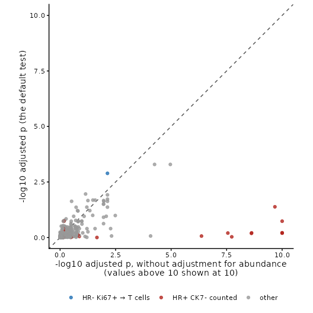

# Introduction to spicyR

Abstract

Do T cells gather around tumour cells more in ER-positive breast cancers
than in ER-negative ones? Do patients whose tumour cells are surrounded
by immune cells relapse later? spicyR answers questions like these for
every pair of cell types in an imaging study. This vignette works
through a study of 456 breast tumours: testing every pair, looking
closely at one, finding the images behind the result, and checking that
the test behaves when there is nothing to find.

## Introduction

A pair is written `from` → `to` and asks whether `to` cells are placed
near `from` cells more than other cells are. For each `to` cell, spicyR
counts the `from` cells within a radius, and compares that count with
what we would expect if the `to` cells were a random choice among the
cells of the same image that are not `from` cells. The difference is the
**excess**: the number of extra `from` cells around each `to` cell,
beyond chance. Because the comparison uses only the cells that are
actually there, empty regions such as holes or air spaces, and uneven
cell density, do not by themselves create a signal (artefacts that
affect one cell type more than others are not removed). spicyR then
compares the excess between groups of patients, treating patients, not
images or cells, as the units of the test.

**Pairs are directional.** Tumour cells → T cells asks whether T cells
are placed near tumour cells (extra tumour cells around each T cell),
which is a different question from T cells → tumour cells (are tumour
cells placed near T cells?).

spicyR needs the type and position of every cell, as from imaging mass
cytometry, CODEX, MIBI, Xenium, CosMx or MERSCOPE; it is not designed
for spot-based data such as Visium.

Other Bioconductor packages also study how cell types are arranged.
*imcRtools* tests interactions between cell types within each image by
permutation, *spatialFDA* compares spatial summary functions between
samples with functional models, and *panoramic* compares a
co-localisation statistic across samples. spicyR is built for the
comparison between groups of patients: it measures co-localisation
against random labelling of the cells actually present, adjusts by
default for how common each cell type is, treats patients as the units,
and uses a test designed to keep false positives at the nominal rate
with modest numbers of patients. It also relates co-localisation to
survival. It works alongside other SydneyBioX packages: per-image
statistics from *Statial* can be compared between groups with spicyR’s
image-level test, and *lisaClust* finds spatial regions.


The pair T cells → proliferating tumour cells. For each proliferating
tumour cell (red, the `to` type), spicyR counts the T cells (blue, the
`from` type) within 25 µm and compares the count with chance. Each
patient gets an excess, and the excess is compared between ER-negative
and ER-positive tumours.

## Installation

spicyR 2.0, described here, is in the development version of
Bioconductor and will be in its next release. Install it with
BiocManager, using Bioconductor devel, or from GitHub:

``` r

if (!requireNamespace("BiocManager", quietly = TRUE)) install.packages("BiocManager")
BiocManager::install("spicyR", version = "devel")

# or, from GitHub
BiocManager::install("SydneyBioX/spicyR")
```

``` r

library(spicyR)
library(SpatialDatasets)
library(ggplot2)
library(survival)
```

## The data

We use imaging mass cytometry of breast tumours from the METABRIC cohort
(Ali et al. 2020). Each of the 456 patients with known oestrogen
receptor (ER) status contributed one tumour core, and the authors
assigned each cell to one of 22 types. Their labels name tumour cells by
marker: HR is hormone receptor, CK cytokeratin, and Ki67+ marks
proliferating cells, so `HR- Ki67+` are proliferating
hormone-receptor-negative tumour cells. The data are a
`SpatialExperiment` in the SpatialDatasets package, with coordinates in
micrometres.

``` r

spe <- spe_Ali_2020()
spe <- spe[, spe$ER.Status %in% c("neg", "pos")]
spe$ER <- factor(ifelse(spe$ER.Status == "pos", "ER+", "ER-"), levels = c("ER-", "ER+"))

table(unique(as.data.frame(SummarizedExperiment::colData(spe))[, c("metabricId", "ER")])$ER)
#> 
#> ER- ER+ 
#>  83 373
sort(table(spe$description), decreasing = TRUE)
#> 
#>                 HR+ CK7-           Myofibroblasts              Fibroblasts 
#>                   114828                    57295                    49043 
#>                 HR- CK7-                 HR- CK7+              HRlow CKlow 
#>                    34951                    29432                    22824 
#>                  T cells           HR+ CK7- Ki67+        Fibroblasts CD68+ 
#>                    19218                    17203                    13716 
#>                HR- Ki67+           HR+ CK7- Slug+   Macrophages Vim+ Slug- 
#>                    13062                     7417                     6721 
#>                  Hypoxia            Myoepithelial                    HER2+ 
#>                     5639                     4637                     4434 
#>   Macrophages Vim+ Slug+ Macrophages Vim+ CD45low              Endothelial 
#>                     3657                     3600                     3480 
#>                  B cells              Basal CKlow            Vascular SMA+ 
#>                     3232                     3226                     2908 
#>           HR- CKlow CK5+ 
#>                     2106
```

``` r

cells <- data.frame(SummarizedExperiment::colData(spe), SpatialExperiment::spatialCoords(spe))
size <- table(cells$file_id)                                  # show the largest core of each group
twoCores <- sapply(c("ER-", "ER+"), function(g) { k <- unique(cells$file_id[cells$ER == g]); k[which.max(size[k])] })
oneEach <- cells[cells$file_id %in% twoCores, ]
oneEach$core <- paste0(oneEach$file_id, " (", oneEach$ER, ")")
ggplot(oneEach, aes(Location_Center_X, Location_Center_Y, colour = description)) +
  geom_point(size = 0.5) +
  facet_wrap(~ core) +
  coord_equal() +
  labs(colour = NULL) +
  theme_void() +
  theme(legend.text = element_text(size = 7)) +
  guides(colour = guide_legend(override.aes = list(size = 2)))
```


## Testing every pair of cell types

[`spicy()`](https://sydneybiox.github.io/spicyR/dev/reference/spicy.md)
needs the column of the condition, the column of the patient (`subject`)
and a radius. It accepts a `SpatialExperiment`, a `SingleCellExperiment`
or a `data.frame` with one row per cell. By default it looks for columns
called `imageID` and `cellType`; here we name the dataset’s own columns.
The coordinates of a `SpatialExperiment` are taken from
[`spatialCoords()`](https://rdrr.io/pkg/SpatialExperiment/man/SpatialExperiment-methods.html).

**Choosing the radius.** Choose it before looking at the results, from
the scale at which you expect cells to interact: 10 to 25 µm for
contact, 50 to 100 µm for a shared neighbourhood. Here we use 25 µm,
about two to three cell diameters. If you are unsure, give several radii
(see [Which radius?](#which-radius)).

``` r

res <- spicy(spe, condition = "ER", subject = "metabricId", r = 25,
             imageID = "file_id", cellType = "description")
res
#> spicyR (cell-level test): 484 pairs, ER+ vs ER-, r = 25
#> Units: 456 patients with 456 images
#> Adjusted for: abundance (unadjusted test in the unadjusted_* columns)
#> BH-adjusted p < 0.05: 19 pairs (34 without adjustment)
#> See topPairs() and $cellResults.
```

All 484 ordered pairs of cell types are tested, in about ten seconds on
one core; run time and memory grow roughly in proportion to the number
of cells and to the radius. By default each comparison is adjusted for
how common the `from` type is in each image, for reasons we come to in
[Why adjust for abundance?](#why-adjust-for-abundance).
[`topPairs()`](https://sydneybiox.github.io/spicyR/dev/reference/topPairs.md)
lists the most significant. `intercept` is the average excess in ER−
patients, and `coefficient` is the difference in average excess between
ER+ and ER− patients (ER+ minus ER−), in extra `from` cells per `to`
cell. P-values are adjusted across all pairs by the Benjamini–Hochberg
method.

``` r

topPairs(res, n = 8)
#>                                intercept coefficient      p.value   adj.pvalue
#> HR- CK7+__HR+ CK7- Ki67+      0.91473529 -0.57943094 2.071318e-06 0.0005130581
#> HR+ CK7- Ki67+__HR- CK7+      0.24376555 -0.18071947 2.120075e-06 0.0005130581
#> T cells__HR- Ki67+            0.01352875  0.21944204 8.011807e-06 0.0012925716
#> HRlow CKlow__HR- CK7+        -0.05475078  0.03836229 9.104840e-05 0.0110168560
#> HR- CK7-__HER2+               0.30230224 -0.18000011 1.242547e-04 0.0120278570
#> Fibroblasts CD68+__HR- Ki67+  0.02082939  0.09210954 2.342215e-04 0.0188938708
#> Fibroblasts__HR- Ki67+        0.15401401  0.21468734 3.015880e-04 0.0207038782
#> Myofibroblasts__HR- CK7+     -0.35601117  0.16487292 3.422129e-04 0.0207038782
#>                                           from             to
#> HR- CK7+__HR+ CK7- Ki67+              HR- CK7+ HR+ CK7- Ki67+
#> HR+ CK7- Ki67+__HR- CK7+        HR+ CK7- Ki67+       HR- CK7+
#> T cells__HR- Ki67+                     T cells      HR- Ki67+
#> HRlow CKlow__HR- CK7+              HRlow CKlow       HR- CK7+
#> HR- CK7-__HER2+                       HR- CK7-          HER2+
#> Fibroblasts CD68+__HR- Ki67+ Fibroblasts CD68+      HR- Ki67+
#> Fibroblasts__HR- Ki67+             Fibroblasts      HR- Ki67+
#> Myofibroblasts__HR- CK7+        Myofibroblasts       HR- CK7+
```

The full results are in `res$cellResults`, with one row per pair:

| Column | Meaning |
|----|----|
| `excess_ref`, `excess_comp` | average excess in the reference group (ER−) and the comparison group (ER+) |
| `excess_difference`, `se`, `df` | their difference, its standard error and degrees of freedom |
| `p_value`, `p_adj` | p-value, and Benjamini–Hochberg adjusted p-value across all pairs |
| `tau2` | how much the excess varies between patients within a group |
| `adjusted_for`, `abundance_effect` | what the test was adjusted for, and the effect of abundance |
| `unadjusted_difference`, `unadjusted_p_value`, `unadjusted_p_adj` | the same test without the adjustment |

With more than two groups there is one row per pair and group, each
compared with the reference group, in a column `level`.

## Seeing every pair at once

[`signifPlot()`](https://sydneybiox.github.io/spicyR/dev/reference/signifPlot.md)
shows the whole study. Read rows as `from` and columns as `to`. Each
circle is a pair: the left half is coloured by the excess in ER− tumours
and the right half by the excess in ER+ tumours (red: more `from` cells
around the `to` cells than chance, blue: fewer), the size reflects the
p-value, and a black ring marks a BH-adjusted p-value below 0.05.

``` r

signifPlot(res, fdr = TRUE, breaks = c(-2, 2, 0.5))
```


## Looking at one pair

We focus on an immune pair, T cells → `HR- Ki67+`: are proliferating
hormone-receptor-negative tumour cells placed near T cells? Its excess
is the number of extra T cells around each of these tumour cells.

``` r

res$cellResults["T cells__HR- Ki67+", c("excess_ref", "excess_comp", "excess_difference", "p_value", "p_adj")]
#>                    excess_ref excess_comp excess_difference      p_value
#> T cells__HR- Ki67+ 0.01352875   0.2329708          0.219442 8.011807e-06
#>                          p_adj
#> T cells__HR- Ki67+ 0.001292572
```

In ER− tumours these tumour cells have no more T cells nearby than
chance would give. In ER+ tumours they have about 0.23 extra T cells
each, roughly one extra T cell for every four tumour cells.

[`spicyBoxPlot()`](https://sydneybiox.github.io/spicyR/dev/reference/spicyBoxPlot.md)
shows the excess in each image (here one image per patient), with a
point per image behind each box. Points are sized by how much the image
contributes to the test.

``` r

spicyBoxPlot(res, from = "T cells", to = "HR- Ki67+") +
  coord_cartesian(ylim = c(-2, 4))
```


With `interactive = TRUE` the plot is a plotly widget: hover over a
point to see which image it is. (It is shown on the [package
website](https://sydneybiox.github.io/spicyR/dev/articles/spicyR.html);
it is left out of the vignette installed with the package to keep it
small.)

``` r

spicyBoxPlot(res, from = "T cells", to = "HR- Ki67+", interactive = TRUE)
```

This is an association in one cohort; it does not show that T cells
attract the tumour cells, or the reverse.

[`bind()`](https://sydneybiox.github.io/spicyR/dev/reference/bind.md)
returns the per-image values as a table, for your own plots or models.
Images without any `HR- Ki67+` cells carry no information about the pair
(`NA`).

``` r

head(bind(res, pairName = "T cells__HR- Ki67+"))
#>        imageID condition subject T cells__HR- Ki67+
#> 1 MB0000_1_527       ER+ MB-0000                 NA
#> 2 MB0002_1_345       ER+ MB-0002        -0.01081081
#> 3 MB0005_1_211       ER+ MB-0005        -0.01289134
#> 4 MB0010_1_420       ER+ MB-0010         0.24657169
#> 5 MB0013_1_371       ER+ MB-0013                 NA
#> 6 MB0014_1_326       ER+ MB-0014         0.29756739
```

## Looking at the images

[`plotImage()`](https://sydneybiox.github.io/spicyR/dev/reference/plotImage.md)
shows one image: the density of all cells in blue, the `from` cells in
gold and the `to` cells in dark red. With `r`, it draws the circle
around each `to` cell inside which `from` cells are counted. We look at
three images found with the interactive box plot.

``` r

pair <- "T cells__HR- Ki67+"
examples <- c("MB0150_1_155", "MB0132_1_533", "MB0244_1_519")
i <- match(examples, res$imageID)
data.frame(image = examples, ER = res$condition[i], excess = res$pairwiseAssoc[[pair]][i],
           weight = res$imageWeights[[pair]][i])
#>          image  ER     excess       weight
#> 1 MB0150_1_155 ER+  1.4550137 3.744636e-03
#> 2 MB0132_1_533 ER- -0.2220841 1.113268e-02
#> 3 MB0244_1_519 ER+  8.2712418 3.523647e-05
```

``` r

for (im in examples)
  print(plotImage(spe, im, from = "T cells", to = "HR- Ki67+", imageID = "file_id", cellType = "description",
                  r = 25) + labs(x = NULL, y = NULL, color = NULL))
```


In the ER+ image on the left, the T cells run along the band of tumour
cells at the bottom: 1.5 extra T cells per tumour cell. In the ER− image
in the middle, the T cells are concentrated top left, apart from most of
the tumour cells, and each tumour cell has slightly fewer T cells nearby
than chance (−0.22). The ER+ image on the right has the largest excess
of all, 8.3, but it comes from just two tumour cells that happen to sit
in a cluster of T cells.

**Point size matters.** The right-hand image is the highest point in the
box plot, but its weight is close to zero: an excess estimated from two
cells says little. Weights also level off. Once an image has a few dozen
`to` cells, more cells add little, because patients differ from one
another more than repeated counts within a patient do. The weights are
in `res$imageWeights`.

## Why adjust for abundance?

A cell type that is simply more common will be found more often around
any other cell, even if cells are arranged no differently. Here the
`HR+ CK7-` tumour cells are much more common in ER+ tumours. Without
adjustment, half of the pairs with `HR+ CK7-` as the `from` type (the
type counted) differ significantly between ER+ and ER− patients, and
they are the most significant pairs of all.

By default, spicyR adjusts each comparison for the log of the `from`
type’s share of all cells in each image. The excess is then compared
between groups at the same abundance, and a difference in arrangement is
not confused with a difference in composition. The unadjusted test is
kept in the `unadjusted_*` columns.

``` r

tab <- res$cellResults[order(res$cellResults$unadjusted_p_value), ]
head(tab[, c("from", "to", "unadjusted_difference", "unadjusted_p_adj", "excess_difference", "p_adj")], 8)
#>                                 from                to unadjusted_difference
#> HR+ CK7-__HR+ CK7- Ki67+    HR+ CK7-    HR+ CK7- Ki67+             1.9930606
#> HR+ CK7-__Fibroblasts       HR+ CK7-       Fibroblasts            -0.5111635
#> HR+ CK7-__HR- CK7+          HR+ CK7-          HR- CK7+             0.9996637
#> HR+ CK7-__Myofibroblasts    HR+ CK7-    Myofibroblasts            -0.3747870
#> HR+ CK7-__HR+ CK7-          HR+ CK7-          HR+ CK7-             1.3933788
#> HR+ CK7-__Fibroblasts CD68+ HR+ CK7- Fibroblasts CD68+            -0.2034117
#> HR+ CK7-__HR- CK7-          HR+ CK7-          HR- CK7-             0.6466170
#> HR+ CK7-__HR+ CK7- Slug+    HR+ CK7-    HR+ CK7- Slug+             1.2171623
#>                             unadjusted_p_adj excess_difference      p_adj
#> HR+ CK7-__HR+ CK7- Ki67+        5.511528e-23        0.23693038 0.63209244
#> HR+ CK7-__Fibroblasts           4.294326e-21        0.05765227 0.61194500
#> HR+ CK7-__HR- CK7+              6.298646e-16        0.27181769 0.18464649
#> HR+ CK7-__Myofibroblasts        3.590827e-12        0.06602786 0.63209244
#> HR+ CK7-__HR+ CK7-              2.118001e-10        0.72822922 0.04147583
#> HR+ CK7-__Fibroblasts CD68+     2.372546e-09        0.03308684 0.62050477
#> HR+ CK7-__HR- CK7-              2.416549e-09        0.13284958 0.65174253
#> HR+ CK7-__HR+ CK7- Slug+        1.859721e-08        0.05437067 0.93489013
```

All but one of the pairs with `HR+ CK7-` as the `from` type are no
longer significant after the adjustment, so their unadjusted signal
largely reflects abundance. Because abundance differs so much with ER
status, the adjusted test also has less power for these pairs, so a
non-significant adjusted result is not evidence of no effect.

``` r

tab$highlight <- ifelse(rownames(tab) == pair, "T cells → HR- Ki67+",
                        ifelse(tab$from == "HR+ CK7-", "HR+ CK7- counted", "other"))
ggplot(tab, aes(pmin(-log10(unadjusted_p_adj), 10), pmin(-log10(p_adj), 10), colour = highlight)) +
  geom_abline(linetype = 2, colour = "grey30") +
  geom_point(alpha = 0.8) +
  scale_colour_manual(values = c("T cells → HR- Ki67+" = "#1f6fb4", "HR+ CK7- counted" = "#b3261e", other = "grey60")) +
  coord_equal(xlim = c(0, 10), ylim = c(0, 10)) +
  labs(x = "-log10 adjusted p, without adjustment for abundance\n(values above 10 shown at 10)",
       y = "-log10 adjusted p (the default test)", colour = NULL) +
  theme_classic() +
  theme(legend.position = "bottom")
```



Our pair is more significant after the adjustment, not less (`p_value`
against `unadjusted_p_value`). Each image has its own share of T cells,
and tumours with many T cells have more T cells near any cell. Adjusting
for it removes this noise. `abundance_effect` is the change in excess
for each unit of log share: positive here, as expected.

``` r

res$cellResults[pair, c("excess_difference", "p_value", "abundance_effect", "abundance_p_value",
                        "unadjusted_difference", "unadjusted_p_value")]
#>                    excess_difference      p_value abundance_effect
#> T cells__HR- Ki67+          0.219442 8.011807e-06       0.08407617
#>                    abundance_p_value unadjusted_difference unadjusted_p_value
#> T cells__HR- Ki67+      1.751034e-07             0.1518117        0.000282357
```

Use the default (adjusted) result when your question is about
arrangement. If a change in composition is part of the biology you are
asking about, use the unadjusted columns, or
`spicy(..., adjustAbundance = FALSE)`.

## Patients with several images

Each METABRIC patient has one core. When patients contribute several
images, give the patient column as `subject`: the images of each patient
are combined, and patients remain the units of the test. The package’s
`diabetesData` has 10 images from each of 12 pancreas donors (Damond et
al. 2019); here we compare the 4 donors at the onset of type 1 diabetes
with the 4 non-diabetic donors.

``` r

data("diabetesData")
diabetes <- diabetesData[, diabetesData$stage %in% c("Non-diabetic", "Onset")]
diabetes$stage <- droplevels(diabetes$stage)
spicy(diabetes, condition = "stage", subject = "case", r = 50)
#> spicyR (cell-level test): 222 pairs, Onset vs Non-diabetic, r = 50
#> Units: 8 patients with 80 images
#> Adjusted for: abundance (unadjusted test in the unadjusted_* columns)
#> BH-adjusted p < 0.05: 0 pairs (0 without adjustment)
#> See topPairs() and $cellResults.
```

No pair is significant with the 8 donors as the units. Leaving out
`subject` treats each of the 80 images as a separate patient:

``` r

spicy(diabetes, condition = "stage", r = 50)
#> spicyR (cell-level test): 222 pairs, Onset vs Non-diabetic, r = 50
#> Units: 80 images (no subject given: each image is a patient)
#> Adjusted for: abundance (unadjusted test in the unadjusted_* columns)
#> BH-adjusted p < 0.05: 2 pairs (9 without adjustment)
#> See topPairs() and $cellResults.
```

Treating every image as an independent patient overstates the evidence:
images from one donor are alike, and here it turns up pairs that the
donors do not support. Always give `subject` when patients have several
images.

## Adjusting for clinical covariates

Covariates measured per patient or per image are added with
`covariates`. Here we also adjust the ER comparison for age at diagnosis
and tumour grade.

``` r

spe$Grade <- factor(spe$Grade)
resCov <- spicy(spe, condition = "ER", subject = "metabricId", r = 25,
                imageID = "file_id", cellType = "description",
                covariates = c("Age.At.Diagnosis", "Grade"))
resCov
#> spicyR (cell-level test): 484 pairs, ER+ vs ER-, r = 25
#> Units: 456 patients with 456 images
#> Adjusted for: abundance, covariates (unadjusted test in the unadjusted_* columns)
#> 3 pairs could not be adjusted and are reported unadjusted (see adjusted_for)
#> BH-adjusted p < 0.05: 4 pairs (34 without adjustment)
#> See topPairs() and $cellResults.
```

The main columns (`excess_difference`, `p_value`, `p_adj`) are now the
ER comparison adjusted for abundance, age and grade. Each covariate also
has its own effect and p-value. A factor has one per level after the
first: `Grade2` and `Grade3` compare grades 2 and 3 with grade 1.

``` r

resCov$cellResults[pair, c("excess_difference", "p_value", "Age.At.Diagnosis_effect", "Age.At.Diagnosis_p_value",
                           "Grade2_effect", "Grade2_p_value", "Grade3_effect", "Grade3_p_value")]
#>                    excess_difference     p_value Age.At.Diagnosis_effect
#> T cells__HR- Ki67+         0.2294387 7.12482e-06             0.001072325
#>                    Age.At.Diagnosis_p_value Grade2_effect Grade2_p_value
#> T cells__HR- Ki67+                0.3061597    0.07453645      0.1817184
#>                    Grade3_effect Grade3_p_value
#> T cells__HR- Ki67+    0.08227635      0.1300123
```

The difference between ER+ and ER− patients is much the same after
adjusting for age and grade, and neither has a clear effect of its own
on this pair. Patients with a missing covariate are left out of the
adjusted test.

A pair that cannot be adjusted, for example because its cell types
appear in images of only one grade, is reported unadjusted, and its
`adjusted_for` column says why. The printed summary above counts these
pairs.

Testing every pair keeps the results the same across analyses. If you
restrict `from` and `to`, the numbers for a pair can shift slightly,
because spicyR estimates how much cells of a type cluster among
themselves from all the pairs it tests.

## Which radius?

The scale of an interaction is rarely known in advance. Give several
radii and spicyR tests them together, using a max-T test that accounts
for the strong correlation between neighbouring radii
(`combine = "cauchy"`, the Cauchy combination of Liu and Xie (2020), is
an alternative).

``` r

resR <- spicy(spe, condition = "ER", subject = "metabricId", r = c(10, 25, 50, 75),
              imageID = "file_id", cellType = "description")
resR$cellResults[c("T cells__HR- Ki67+", "B cells__HR- Ki67+"), c("r", "excess_difference", "p_value")]
#>                     r excess_difference      p_value
#> T cells__HR- Ki67+ 25        0.21944204 2.731342e-05
#> B cells__HR- Ki67+ 50        0.08572214 1.069835e-02
```

`r` is the radius with the strongest evidence, and `p_value` the
combined p-value over all radii.

The excess grows with the radius simply because larger circles hold more
cells, so compare p-values across radii rather than the size of the
excess. The excess at the chosen radius is a little optimistic, because
that radius was picked for its strength. This combined test is new, and
its calibration is still being checked.

``` r

profile <- resR$radiusResults[resR$radiusResults$to == "HR- Ki67+" &
                                resR$radiusResults$from %in% c("T cells", "B cells"), ]
ggplot(profile, aes(r, -log10(p_value), colour = from)) +
  geom_line() +
  geom_point() +
  expand_limits(y = 0) +
  labs(x = "radius (µm)", y = "-log10 p at each radius, ER+ vs ER-", colour = "counted around HR- Ki67+") +
  theme_classic()
```


## Is co-localisation associated with survival?

With a `Surv` column as the condition, spicyR asks whether a patient’s
excess is associated with their outcome. Here we use relapse-free
survival, adjusting for age.

``` r

spe$RFS <- Surv(spe$timeRFS, spe$eventRFS)
resS <- spicy(spe, condition = "RFS", subject = "metabricId", r = 25,
              imageID = "file_id", cellType = "description", covariates = "Age.At.Diagnosis")
resS
#> spicyR (cell-level test): 484 pairs, association with survival, r = 25
#> Units: 456 patients with 456 images
#> Adjusted for: abundance, covariates (unadjusted test in the unadjusted_* columns)
#> BH-adjusted p < 0.05: 0 pairs (3 without adjustment)
#> See topPairs() and $cellResults.
head(resS$cellResults[order(resS$cellResults$p_value),
                      c("from", "to", "p_value", "p_adj", "hazard_ratio_sd", "unadjusted_p_value", "unadjusted_p_adj")])
#>                                                             from             to
#> HRlow CKlow__HR- CK7+                                HRlow CKlow       HR- CK7+
#> Vascular SMA+__HER2+                               Vascular SMA+          HER2+
#> HR- CK7+__HRlow CKlow                                   HR- CK7+    HRlow CKlow
#> Basal CKlow__Myoepithelial                           Basal CKlow  Myoepithelial
#> Macrophages Vim+ CD45low__Myoepithelial Macrophages Vim+ CD45low  Myoepithelial
#> HR+ CK7-__HR+ CK7- Ki67+                                HR+ CK7- HR+ CK7- Ki67+
#>                                             p_value     p_adj hazard_ratio_sd
#> HRlow CKlow__HR- CK7+                   0.000294744 0.1426561       0.7096738
#> Vascular SMA+__HER2+                    0.001148443 0.2402531              NA
#> HR- CK7+__HRlow CKlow                   0.001489172 0.2402531       0.7481943
#> Basal CKlow__Myoepithelial              0.007104592 0.7306842       0.7143004
#> Macrophages Vim+ CD45low__Myoepithelial 0.008175431 0.7306842       0.7133472
#> HR+ CK7-__HR+ CK7- Ki67+                0.009058068 0.7306842       0.7927419
#>                                         unadjusted_p_value unadjusted_p_adj
#> HRlow CKlow__HR- CK7+                         0.0001923491       0.03544836
#> Vascular SMA+__HER2+                          0.0007754965       0.09383508
#> HR- CK7+__HRlow CKlow                         0.0025619655       0.24799826
#> Basal CKlow__Myoepithelial                    0.0082132282       0.39752025
#> Macrophages Vim+ CD45low__Myoepithelial       0.0145471257       0.50291492
#> HR+ CK7-__HR+ CK7- Ki67+                      0.0001081977       0.03544836
```

The p-value comes from a score test that relates each patient’s excess
to their outcome. `hazard_ratio_sd` is the hazard ratio for a one
standard deviation higher excess, from a Cox model; below one, patients
with a higher excess had a lower risk of relapse. It is missing when the
excess barely varies between patients.

No pair is significant after adjusting for multiple testing. Without the
abundance adjustment, three pairs are, all with tumour cell types as the
`from` type. Tumour composition is itself prognostic, so those three may
reflect composition as much as the arrangement of cells.

## A check you can run

A test should give few significant results when there is nothing to
find. Shuffling the ER labels across patients removes any real
difference, so about 5% of pairs should then have p \< 0.05, and about
1% p \< 0.01.

``` r

set.seed(2026)
patients <- unique(as.data.frame(SummarizedExperiment::colData(spe))[, c("metabricId", "ER")])
shuffles <- do.call(rbind, lapply(1:5, function(i) {
  label <- setNames(sample(patients$ER), patients$metabricId)
  spe$shuffled <- label[spe$metabricId]
  s <- spicy(spe, condition = "shuffled", subject = "metabricId", r = 25,
             imageID = "file_id", cellType = "description")
  data.frame(shuffle = i, threshold = c("p < 0.05", "p < 0.01"),
             percent = 100 * c(mean(s$cellResults$p_value < 0.05), mean(s$cellResults$p_value < 0.01)))
}))
aggregate(percent ~ threshold, shuffles, mean)
#>   threshold  percent
#> 1  p < 0.01 1.115702
#> 2  p < 0.05 4.917355
```

``` r

ggplot(shuffles, aes(threshold, percent)) +
  geom_jitter(width = 0.1, height = 0, size = 2, alpha = 0.7) +
  geom_point(data = data.frame(threshold = c("p < 0.05", "p < 0.01"), percent = c(5, 1)),
             shape = 95, size = 14, colour = "#b3261e") +
  scale_y_continuous(limits = c(0, 15), labels = function(v) paste0(v, "%")) +
  labs(x = NULL, y = "pairs below the threshold", title = "5 shuffles of the ER labels (red: expected)") +
  theme_classic()
```


Pairs share cells, so the percentage moves by a few points from one
shuffle to the next.

Run this check on your own data before trusting a discovery. It takes a
few minutes and shows whether the test is calibrated for your study
design.

## How it works

For a pair `from` → `to` and an image, let *O* be the number of `from`
cells within *r* of the `to` cells. If the `to` cells were a random
choice among the cells of the image that are not `from` cells, keeping
every cell where it is, *O* would have an exact mean and variance, which
spicyR computes without permutations. The excess of an image is

``` math
\delta = \frac{O - \mathrm{E}_{\mathrm{RL}}(O)}{n},
```

where $`\mathrm{E}_{\mathrm{RL}}(O)`$ is that expectation under random
labelling and *n* is the number of `to` cells.

Images from the same patient are combined, giving more weight to more
informative images (usually those with more `to` cells). Each patient
has its own true excess, which varies around its group’s mean by an
amount estimated from the data (a frailty, or random-effects, model,
with the between-patient variance estimated as by Paule and Mandel
(1982)). The difference between groups, adjusted for the log share of
the `from` type in each image and any covariates, is tested with a
small-sample cluster-robust (CR2) variance on Satterthwaite degrees of
freedom (Bell and McCaffrey 2002; Pustejovsky and Tipton 2018), with
patients as the clusters. This is designed to keep false positives near
the nominal rate even with modest numbers of patients. When the `to`
cells cluster among themselves, the within-image variance is inflated to
match. A paper describing the method is in preparation.

## Small studies

With fewer than about ten patients per group, expect few significant
pairs, even when an effect is consistent across patients: a calibrated
test cannot be confident with little information. Look at whether the
patients agree in direction with
[`spicyBoxPlot()`](https://sydneybiox.github.io/spicyR/dev/reference/spicyBoxPlot.md).

`variance = "hartung_knapp"` (Hartung and Knapp 2001) can give more
power in very small studies. It assumes that patients vary about equally
in both groups and can give too many small p-values for rare cell types,
so it is not the default.

## Reporting results

A methods sentence might read: “We used spicyR (version 1.99.4) to test,
for every ordered pair of cell types, whether the number of `from` cells
within 25 µm of each `to` cell, relative to random labelling of the
cells in each image, differed between ER+ and ER− patients, adjusting
for the abundance of the `from` type in each image, with patients as the
units of analysis. P-values were adjusted across pairs by the
Benjamini–Hochberg method.” Show a per-patient plot
([`spicyBoxPlot()`](https://sydneybiox.github.io/spicyR/dev/reference/spicyBoxPlot.md))
and an image of the pair
([`plotImage()`](https://sydneybiox.github.io/spicyR/dev/reference/plotImage.md))
alongside the p-value.

``` r

citation("spicyR")
#> To cite spicyR in publications please use:
#> 
#>   Canete N, Iyengar S, Ormerod J, Baharlou H, Harman A, Patrick E
#>   (2022). "spicyR: spatial analysis of in situ cytometry data in R."
#>   _Bioinformatics_, *38*(11), 3099-3105.
#>   doi:10.1093/bioinformatics/btac268
#>   <https://doi.org/10.1093/bioinformatics/btac268>.
#> 
#> A BibTeX entry for LaTeX users is
#> 
#>   @Article{,
#>     title = {{spicyR: spatial analysis of in situ cytometry data in R}},
#>     author = {Nicolas Canete and Sourish Iyengar and John Ormerod and Heeva Baharlou and Andrew Harman and Ellis Patrick},
#>     year = {2022},
#>     volume = {38},
#>     number = {11},
#>     pages = {3099--3105},
#>     journal = {Bioinformatics},
#>     doi = {10.1093/bioinformatics/btac268},
#>   }
```

## Coming from spicyR 1.x

spicyR 2.0 changes the default test. Before 2.0,
[`spicy()`](https://sydneybiox.github.io/spicyR/dev/reference/spicy.md)
compared a per-image summary of the L-function between groups with a
weighted mixed model (Canete et al. 2022). That test is still available,
and gives the same results as before, with `method = "image"`; it is
described in the vignette “The original image-level test in spicyR”. It
is also the method to use with your own per-image statistics
(`alternateResult`), for example from the Statial package.
[`topPairs()`](https://sydneybiox.github.io/spicyR/dev/reference/topPairs.md),
[`signifPlot()`](https://sydneybiox.github.io/spicyR/dev/reference/signifPlot.md),
[`spicyBoxPlot()`](https://sydneybiox.github.io/spicyR/dev/reference/spicyBoxPlot.md)
and
[`bind()`](https://sydneybiox.github.io/spicyR/dev/reference/bind.md)
work with both tests.

``` r

resImage <- spicy(spe, condition = "ER", subject = "metabricId", method = "image",
                  imageID = "file_id", cellType = "description",
                  from = "T cells", to = "HR- Ki67+")
topPairs(resImage)
#>                    intercept coefficient   p.value adj.pvalue    from        to
#> T cells__HR- Ki67+  3.722601   -6.981016 0.3419058  0.3419058 T cells HR- Ki67+
```

The image-level test summarises a different statistic, on a different
scale, so its coefficient is not comparable with the excess; here it
finds no evidence of a difference either way.

## Python

The Python package [spicyr](https://sydneybiox.github.io/spicyr-py) runs
the same cell-level test on AnnData, SpatialData and pandas objects, on
the same C++ code, and gives the same results; its tutorial is this
vignette in Python. The names follow Python conventions:

| R (spicyR) | Python (spicyr) |
|----|----|
| `spicy(spe, condition, subject, imageID =, cellType =, from =, to =)` | `spicy(adata, condition, subject, image_id=, cell_type=, from_=, to=)` |
| `condition = "RFS"` with a `Surv(time, event)` column | `survival=("timeRFS", "eventRFS")` |
| `topPairs(res)`, `res$cellResults` | `res.top_pairs()`, `res.cell_results` |
| `signifPlot(res)`, `spicyBoxPlot(res, from, to)`, `bind(res)` | `res.signif_plot()`, `res.box_plot(from_, to)`, `res.bind()` |
| `plotImage(spe, image, from, to)`, `res$imageWeights` | `spicyr.plot_image(adata, image, from_, to)`, `res.image_weights` |

The image-level test is available only in R.

## Session information

``` r

sessionInfo()
#> R version 4.6.1 (2026-06-24)
#> Platform: x86_64-pc-linux-gnu
#> Running under: Ubuntu 24.04.5 LTS
#> 
#> Matrix products: default
#> BLAS:   /usr/lib/x86_64-linux-gnu/openblas-pthread/libblas.so.3 
#> LAPACK: /usr/lib/x86_64-linux-gnu/openblas-pthread/libopenblasp-r0.3.26.so;  LAPACK version 3.12.0
#> 
#> locale:
#>  [1] LC_CTYPE=C.UTF-8       LC_NUMERIC=C           LC_TIME=C.UTF-8       
#>  [4] LC_COLLATE=C.UTF-8     LC_MONETARY=C.UTF-8    LC_MESSAGES=C.UTF-8   
#>  [7] LC_PAPER=C.UTF-8       LC_NAME=C              LC_ADDRESS=C          
#> [10] LC_TELEPHONE=C         LC_MEASUREMENT=C.UTF-8 LC_IDENTIFICATION=C   
#> 
#> time zone: UTC
#> tzcode source: system (glibc)
#> 
#> attached base packages:
#> [1] stats4    stats     graphics  grDevices utils     datasets  methods  
#> [8] base     
#> 
#> other attached packages:
#>  [1] survival_3.8-6              ggplot2_4.0.3              
#>  [3] SpatialDatasets_1.10.0      SpatialExperiment_1.22.0   
#>  [5] SingleCellExperiment_1.34.0 SummarizedExperiment_1.42.0
#>  [7] Biobase_2.72.0              GenomicRanges_1.64.0       
#>  [9] Seqinfo_1.2.0               IRanges_2.46.0             
#> [11] S4Vectors_0.50.3            MatrixGenerics_1.24.0      
#> [13] matrixStats_1.5.0           ExperimentHub_3.2.2        
#> [15] AnnotationHub_4.2.2         BiocFileCache_3.2.0        
#> [17] dbplyr_2.6.0                BiocGenerics_0.58.1        
#> [19] generics_0.1.4              spicyR_1.99.4              
#> [21] BiocStyle_2.40.0           
#> 
#> loaded via a namespace (and not attached):
#>  [1] tidyselect_1.2.1     viridisLite_0.4.3    dplyr_1.2.1         
#>  [4] farver_2.1.2         blob_1.3.0           filelock_1.0.3      
#>  [7] Biostrings_2.80.2    S7_0.2.2             fastmap_1.2.0       
#> [10] digest_0.6.39        lifecycle_1.0.5      KEGGREST_1.52.2     
#> [13] RSQLite_3.53.3       magrittr_2.0.5       compiler_4.6.1      
#> [16] rlang_1.3.0          sass_0.4.10          tools_4.6.1         
#> [19] yaml_2.3.12          data.table_1.18.6.1  knitr_1.52          
#> [22] labeling_0.4.3       S4Arrays_1.12.1      htmlwidgets_1.6.4   
#> [25] bit_4.6.0            curl_8.0.0           DelayedArray_0.38.2 
#> [28] RColorBrewer_1.1-3   abind_1.4-8          purrr_1.2.2         
#> [31] withr_3.0.3          desc_1.4.3           grid_4.6.1          
#> [34] MASS_7.3-65          scales_1.4.0         cli_3.6.6           
#> [37] rmarkdown_2.32       crayon_1.5.3         ragg_1.5.2          
#> [40] otel_0.2.0           httr_1.4.9           rjson_0.2.23        
#> [43] DBI_1.3.0            cachem_1.1.0         splines_4.6.1       
#> [46] AnnotationDbi_1.74.0 BiocManager_1.30.27  XVector_0.52.0      
#> [49] vctrs_0.7.3          Matrix_1.7-5         jsonlite_2.0.0      
#> [52] bookdown_0.48        bit64_4.8.6          crosstalk_1.2.2     
#> [55] systemfonts_1.3.2    magick_2.9.1         plotly_4.12.1       
#> [58] tidyr_1.3.2          jquerylib_0.1.4      glue_1.8.1          
#> [61] pkgdown_2.2.1        gtable_0.3.6         BiocVersion_3.23.1  
#> [64] tibble_3.3.1         pillar_1.11.1        rappdirs_0.3.4      
#> [67] htmltools_0.5.9      R6_2.6.1             httr2_1.3.0         
#> [70] textshaping_1.0.5    evaluate_1.0.5       lattice_0.22-9      
#> [73] png_0.1-9            memoise_2.0.1        bslib_0.12.0        
#> [76] Rcpp_1.1.2           SparseArray_1.12.3   xfun_0.61           
#> [79] fs_2.1.0             pkgconfig_2.0.3
```

## References

Ali, H Raza, Hartland W Jackson, Vito R T Zanotelli, et al. 2020.
“Imaging Mass Cytometry and Multiplatform Genomics Define the
Phenogenomic Landscape of Breast Cancer.” *Nature Cancer* 1 (2): 163–75.
<https://doi.org/10.1038/s43018-020-0026-6>.

Bell, Robert M., and Daniel F. McCaffrey. 2002. “Bias Reduction in
Standard Errors for Linear Regression with Multi-Stage Samples.” *Survey
Methodology* 28 (2): 169–81.

Canete, Nicolas P, Sourish S Iyengar, John T Ormerod, Heeva Baharlou,
Andrew N Harman, and Ellis Patrick. 2022. “spicyR: Spatial Analysis of
in Situ Cytometry Data in r.” *Bioinformatics* 38 (11): 3099–105.
<https://doi.org/10.1093/bioinformatics/btac268>.

Damond, Nicolas, Stefanie Engler, Vito R. T. Zanotelli, Denis Schapiro,
et al. 2019. “A Map of Human Type 1 Diabetes Progression by Imaging Mass
Cytometry.” *Cell Metabolism* 29 (3): 755–68.
<https://doi.org/10.1016/j.cmet.2018.11.014>.

Hartung, Joachim, and Guido Knapp. 2001. “A Refined Method for the
Meta-Analysis of Controlled Clinical Trials with Binary Outcome.”
*Statistics in Medicine* 20 (24): 3875–89.
<https://doi.org/10.1002/sim.1009>.

Liu, Yaowu, and Jun Xie. 2020. “Cauchy Combination Test: A Powerful Test
with Analytic p-Value Calculation Under Arbitrary Dependency
Structures.” *Journal of the American Statistical Association* 115
(529): 393–402. <https://doi.org/10.1080/01621459.2018.1554485>.

Paule, Robert C., and John Mandel. 1982. “Consensus Values and Weighting
Factors.” *Journal of Research of the National Bureau of Standards* 87
(5): 377–85. <https://doi.org/10.6028/jres.087.022>.

Pustejovsky, James E., and Elizabeth Tipton. 2018. “Small-Sample Methods
for Cluster-Robust Variance Estimation and Hypothesis Testing in Fixed
Effects Models.” *Journal of Business & Economic Statistics* 36 (4):
672–83. <https://doi.org/10.1080/07350015.2016.1247004>.
